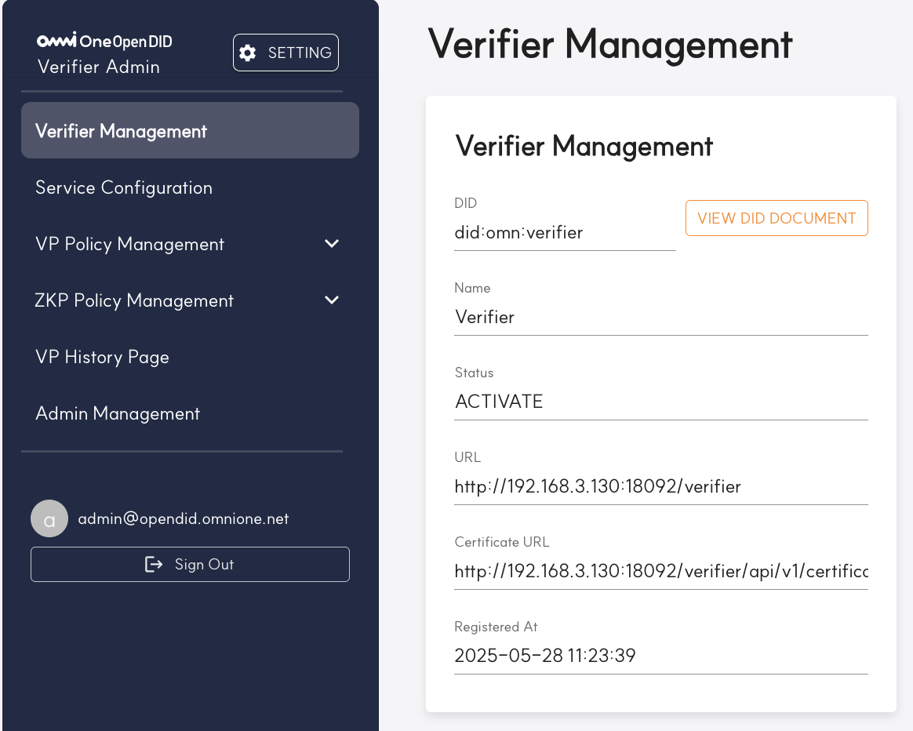
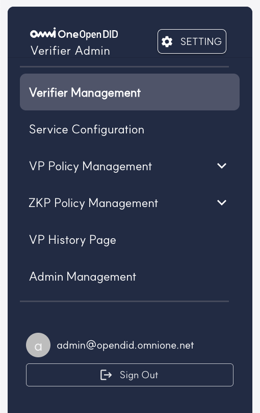
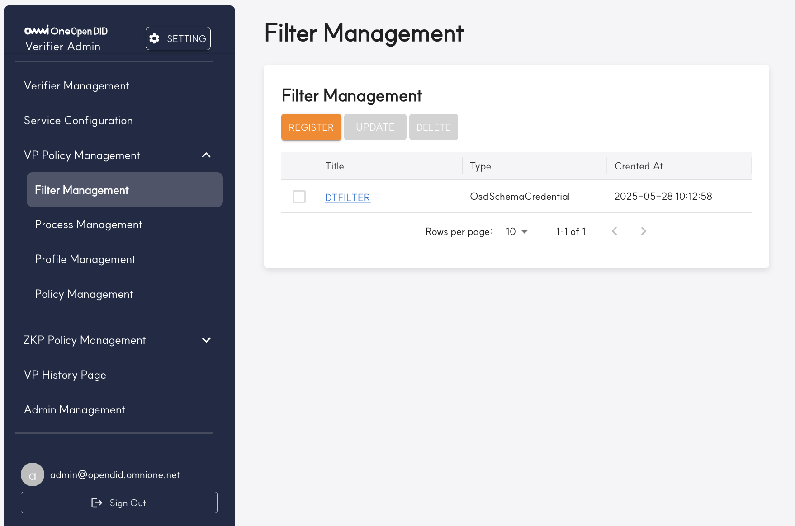

---
puppeteer:
    pdf:
        format: A4
        displayHeaderFooter: true
        landscape: false
        scale: 0.8
        margin:
            top: 1.2cm
            right: 1cm
            bottom: 1cm
            left: 1cm
    image:
        quality: 100
        fullPage: false
---

Open DID Verifier Admin Operation Guide
==

- Date: 2025-05-30
- Version: v2.0.0

Revision History
==
| Version | Date       | Changes                                        |
| ------- | ---------- | ---------------------------------------------- |
| v1.0.0  | 2025-03-31 | Initial creation                               |
| v1.0.1  | 2025-04-25 | Added `3.1. Verifier Registration` section    |
| v2.0.0  | 2025-05-30 | Added ZKP verification menus and feature changes |

Table of Contents
==
- [Revision History](#revision-history)
- [1. Introduction](#1-introduction)
  - [1.1. Overview](#11-overview)
  - [1.2. Admin Console Definition](#12-admin-console-definition)
- [2. Basic Manual](#2-basic-manual)
  - [2.1. Login](#21-login)
  - [2.2. Main Screen Layout](#22-main-screen-layout)
  - [2.3. Menu Structure](#23-menu-structure)
  - [2.4. Password Change Management](#24-password-change-management)
- [3. Feature-specific Detailed Manual](#3-feature-specific-detailed-manual)
  - [3.1. Verifier Management](#31-verifier-management)
    - [3.1.1. Verifier Registration](#311-verifier-registration)
    - [3.1.2. Registered Verifier Management](#312-registered-verifier-management)
  - [3.2. VP Policy Management](#32-vp-policy-management)
    - [3.2.1. Service Management](#321-service-management)
      - [3.2.1.1 Service Register](#3211-service-register)
    - [3.2.2. Filter Management](#322-filter-management)
      - [3.2.2.1 Filter Register](#3221-filter-register)
    - [3.2.3. Process Management](#323-process-management)
      - [3.2.3.1 Process Register](#3231-process-register)
    - [3.2.4. Profile Management](#324-profile-management)
      - [3.2.4.1 Profile Register](#3241-profile-register)
    - [3.2.5. Policy Management](#325-policy-management)
      - [3.2.5.1 Policy Register](#3251-policy-register)
  - [3.3. ZKP Policy Management](#33-zkp-policy-management)
    - [3.3.1. Proof Request Configuration](#331-proof-request-configuration)
      - [3.3.1.1 Proof Request Register](#3311-proof-request-register)
    - [3.3.2. ZKP Profile Management](#332-zkp-profile-management)
      - [3.3.2.1 ZKP Profile Register](#3321-zkp-profile-register)
    - [3.3.3. ZKP Policy Management](#333-zkp-policy-management)
      - [3.3.3.1 ZKP Policy Register](#3331-zkp-policy-register)
  - [3.4. VP History Page](#34-vp-history-page)
  - [3.5. Admin Management](#35-admin-management)
    - [3.5.1 Admin List View](#351-admin-list-view)
    - [3.5.2 Admin Registration](#352-admin-registration)

# 1. Introduction

## 1.1. Overview

This document provides a guide for the installation and operation of the Open DID Verifier Admin Console. It explains the basic manual and feature-specific detailed manuals step by step to help users efficiently use the system.

For the overall installation guide of OpenDID, please refer to the [Open DID Installation Guide].

<br/>

## 1.2. Admin Console Definition

The Verifier Admin Console is a web-based management tool for managing Verifier servers in the Open DID system. Through this tool, administrators can set up Verifiable Presentation (VP) and ZKP Credential verification policies, monitor verification requests and results, and manage system settings.

The Admin Console provides the following key features:

- **Verifier Basic Information Management**
  - Verifier server registration and status monitoring
- **Service (Payload) Basic Information Management**
  - Service (payload) registration and item configuration
- **VP Policy Item Management**
  - Profile Filter registration and management
  - Profile Process registration and management
  - VP Profile configuration
  - VP Policy settings
- **ZKP Policy Item Management**
  - Proof Request registration and management
  - ZKP Profile registration and management
  - ZKP Policy settings
- **VP History**
  - VP verification history tracking
- **Administrator Account Management**
  - Admin Console account management

# 2. Basic Manual

This chapter provides guidance on the basic usage of the Open DID Verifier Admin Console.

## 2.1. Login

To access the Admin Console, follow these steps:

1. Open a web browser and navigate to the Verifier Admin Console URL.

   ```
   http://<verifier_domain>:<port>
   ```

2. On the login screen, enter the administrator account email and password.
   - Default administrator account: admin@opendid.omnione.net
   - Initial password: password (password change required on first login)

3. Click the 'Login' button.

> **Note**: For security reasons, a password change is required upon first login.

<br/>

## 2.2. Main Screen Layout

The main screen displayed after login consists of the following elements:



| No. | Area | Description |
|-----|------|-------------|
| 1 | Settings Button | Clicking the 'SETTING' button navigates to a screen where you can change the password of the currently logged-in account. |
| 2 | Content Header | The title of the currently selected menu is displayed. The corresponding page name is shown for each menu. |
| 3 | Sidebar Menu | Lists menus that provide access to key features including Verifier Management. |
| 4 | User Information Area | Displays the currently logged-in administrator's email (admin@opendid.omnione.net) and logout button. |

<br/>

## 2.3. Menu Structure

The sidebar menu of the Verifier Admin Console **differs in screen layout depending on the Verifier registration status**.

### 2.3.1. Verifier Unregistered State

In the initial state where the Verifier server has not yet been registered, only the Verifier Registration item is displayed in the menu.


> Note: Once Verifier registration is completed, related features will be activated and the full menu will be expanded. Details about the menu structure after registration are explained in subsequent sections.

### 2.3.2. Verifier Registered State

Once Verifier registration is completed, all management features are activated, and the sidebar menu is structured as follows:



| No. | Feature Name | Feature Description |
|-----|--------------|-------------------|
| 1 | **Verifier Management** | Menu for managing service verifiers. Verifier-related settings and management tasks can be performed here. |
| 2 | **Service Configuration** | Menu for configuring service information to be used in VP policies. |
| 3 | **VP Policy Management** | Parent menu for managing VP policies. Clicking this item displays sub-menus. |
| 4 | **ZKP Policy Management** | Parent menu for managing ZKP policies. Clicking this item displays sub-menus. |
| 5 | **VP History Page** | Menu that navigates to the VP history page. You can check past VP records. |
| 6 | **Admin Management** | Menu for managing administrator-related settings. You can adjust administrator accounts and permissions. |

<br/>

## 2.4. Password Change Management

User password changes can be performed through the following steps:

1. Click the 'SETTING' button in the header area.
2. Select 'Password Change' from the settings menu.
3. On the password change screen:
   - Enter current password
   - Enter new password
   - Confirm new password
4. Click the 'Save' button to apply changes.

> **Note**: Password must be between 8 and 64 characters.

<br/>

# 3. Feature-specific Detailed Manual

This chapter provides detailed usage instructions for the main features of the Open DID Verifier Admin Console.

## 3.1. Verifier Management

Verifier Management is a feature for registering and managing the status of Verifier servers.

The Verifier server performs the role of verifying VP (Verifiable Presentation) and ZKP Proof submitted from users' VC (Verifiable Credential) in the Open DID system.

Verifier registration is performed only once initially, and afterwards, the registered status can be checked in the management screen.

### 3.1.1. Verifier Registration

When the Verifier server has not yet been registered with the Open DID system in the initial state, only the `Verifier Registration` item is displayed in the left menu of the Verifier Admin Console.

Verifier registration proceeds sequentially through a total of 3 steps.

**Step 1 - Enter Verifier Info**

This is the step to enter Verifier information.


| Item | Description |
|------|-------------|
| **Name** | Enter the name of the Verifier server. Example: `verifier` |
| **Verifier URL** | Enter the call URL of the Verifier server. Use format `http://<IP>:8094/verifier` |
| **Test Connection Button** | Checks if actual connection is possible with the entered URL. |
| **NEXT Button** | Moves to the next step. |

<br/>

**Step 2 - Register DID Document**

In this step, the Verifier's DID Document is generated and a registration request is sent to TA Admin. Once registered, the DID Document **cannot be changed or re-registered**.

▶ **Step 2-1: Generate DID Document**

Generate the DID Document for the Verifier server.


| Item | Description |
|------|-------------|
| **GENERATE Button** | Generates the DID Document for the Verifier server. Results are displayed in the lower area after generation. |
| **Request Status Display** | Can be confirmed with a green message when the request is successful. |

When the DID Document is successfully generated, **Step 2-2 area is automatically displayed on the screen**.

<br/>

▶ **Step 2-2 - Submit Registration Request**

Submit a registration request for the generated DID Document to TA Admin.


| Item | Description |
|------|-------------|
| **REQUEST Button** | Sends a registration request for the generated DID Document to TA Admin. |
| **Request Status Display** | Can be confirmed with a green message when the request is successful. |

When the DID Document is successfully generated, **Step 2-3 area is automatically displayed on the screen**.

<br/>

▶ **Step 2-3 - Check Approval Status**

Check if the TA administrator has approved the DID Document registration request.


| Item | Description |
|------|-------------|
| **CHECK Button** | Checks if the TA administrator has approved the registration request. |
| **Approval Status Display** | When approval is complete, you can proceed to the next step with a green message. |

<br/>

**Step 3 - Enroll Entity**

This is the step to request Verifier registration as an Entity to the TA server and receive a Certificate VC.

At this time, the registration request follows the flow of the user registration protocol (P132) among TA protocols, and the Verifier Admin performs the registration procedure by calling the corresponding protocol APIs.


| Item | Description |
|------|-------------|
| **REQUEST** | Sends an Entity registration request to the TA server. |
| **FINISH** | Completes registration and moves to the final completion state. |

### 3.1.2. Registered Verifier Management

In the Verifier Management menu, you can view information about Verifier servers registered with certificates. This screen displays basic Verifier information, and modification or deletion is not possible.


| No. | Item | Description |
|-----|------|-------------|
| 1 | DID | The unique identifier of the Verifier. Displayed in format like 'did:omn:verifier'. |
| 2 | Name | The name of the Verifier. The name displayed during VP verification. |
| 3 | Status | Indicates the activation status of the Verifier. Shows ACTIVATE or DEACTIVATE status. |
| 4 | URL | The basic URL address of the Verifier service. |
| 5 | Certificate URL | The URL address where you can check the Verifier's certificate. |
| 6 | Registered At | Displays the date and time when the Verifier was registered. |
| 7 | VIEW DID DOCUMENT | Button to check the DID document. When clicked, DID document information registered on the blockchain is displayed in popup format. |
| 8 | DID Document Content | The content of the DID Document displayed when the VIEW DID DOCUMENT button is clicked. Includes Verifier's DID information, controller, creation date, verification methods, etc. in JSON format. |

#### 3.1.2.1. DID Document Inquiry

To inquire about the DID Document, follow these steps:

1. Click the 'VIEW DID DOCUMENT' button on the Verifier Management screen.
2. A popup window opens and displays the entire content of the DID Document registered on the blockchain in JSON format.
3. To close the popup window, click outside the window.

<br/>

## 3.2. VP Policy Management

VP Policy Management is a menu for managing VP (Verifiable Presentation) policies. It consists of several sub-menus, each managing specific aspects of VP policies.

### 3.2.1. Service Management

In the Service Management menu, you can register, modify, and delete service information to be used in VP policies.

> **Note**: All Management pages have the same page structure/functionality. Detailed explanation is provided here, and only structural differences will be explained thereafter.


| No. | Item | Description |
|-----|------|-------------|
| 1 | REGISTER | Button to register a new service. Clicking navigates to the service registration page. |
| 2 | UPDATE | Button to modify selected service information. Activated when a checkbox is selected from the list. |
| 3 | DELETE | Button to delete selected service. Activated when a checkbox is selected from the list. |
| 4 | Service List Header | Header section of the table displaying service information. Shows service attributes like Service Name, Device, Lock Status, Submission Mode. |
| 5 | Service Items | Displays the list of registered services. You can select services through checkboxes to modify or delete them. |
| 6 | Pagination | Manages pages of the service list. You can check the number of rows to display per page and current page information. |

#### Service Registration, Modification, Deletion

1. **Service Registration**
   - Clicking the 'REGISTER' button navigates to the service registration page.
   - Enter required information on the service registration page and save.
   - Refer to the separate detailed guide for more information about service registration.

2. **Service Modification**
   - Select the checkbox in front of the service item to modify.
   - Click the 'UPDATE' button when it becomes active.
   - Change information on the service modification page and save.
   - Refer to the separate detailed guide for more information about service modification.

3. **Service Deletion**
   - Select the checkbox in front of the service item to delete.
   - Click the 'DELETE' button when it becomes active.
   - When a confirmation message is displayed, click 'Confirm' to complete deletion.

> **Note**: Only one service can be selected at a time for modification/deletion.

#### 3.2.1.1 Service Register

On the service registration page, you can enter information to register a new service. The screenshot below shows a state where sample data has already been entered. Items that must be entered are marked with an asterisk (*).


| No. | Item | Description |
|-----|------|-------------|
| 1 | Service | Field to enter the service name to be provided through verification. "age verification" is entered as an example. |
| 2 | Lock Status | Select the lock status of the service. You can select "Locked" or "Unlocked" from the dropdown menu. |
| 3 | Device | Enter the device type supported by the service. "PC" is entered as an example. |
| 4 | Submission Mode | Select the submission mode. You can select "Direct" or "Indirect" from the dropdown menu. |
| 5 | Submission Mode | Select the submission mode. You can select "Direct" or "Indirect" from the dropdown menu. |
| 6 | Verification Type | Select the verification type. You can choose ZKP (ZKP verification) or VP (general VP). |
| 7 | Endpoints | Section for managing service endpoints. Click the "ADD ENDPOINT" button to add multiple URLs. Each endpoint must be in valid URL format. To delete an entered endpoint, click the trash icon on the right side of the corresponding row. |
| 8 | Button Area | - REGISTER: Registers service with entered information.<br>- RESET: Initializes all input fields. In modification mode, reverts to existing input values.<br>- CANCEL: Cancels input and returns to previous page (service list). |

> **Warning**: Services already registered in Policy cannot be deleted. To delete, you must first remove the corresponding service from the connected Policy. You can check in advance by the count number in the service list.

### 3.2.2. Filter Management

In the Filter Management menu, you can manage filter conditions to be used during VP verification. This screen allows you to check the filter list and perform registration, modification, and deletion operations.



Filter Management screen provides the following key features:
- REGISTER: Register a new filter.
- UPDATE: Modify selected filter (activated when an item is selected).
- DELETE: Delete selected filter (activated when an item is selected).

The filter list table displays information such as Title, Type, Created At, and you can navigate through multiple pages of data using pagination functionality.

#### 3.2.2.1 Filter Register

On the filter registration page, you can enter information to register a new filter. This page uses the same form when modifying filters.


| No. | Item | Description |
|-----|------|-------------|
| 1 | Title | Field to enter the filter title. This value is used during filter searches later. |
| 2 | ID | VC schema ID to be used in the filter. Use the SEARCH button to find and enter schema ID from List provider. |
| 3 | Type | Select schema type. Currently fixed to OsdSchemaCredential. |
| 4 | Required Claims | Section for managing essential claims required for verification. Click "ADD REQUIRED CLAIMS" button to add claims corresponding to the schema ID. To delete entered claims, click the trash icon on the right side of the corresponding item. |
| 5 | Display Claims | Section for managing claim information to be displayed. To delete entered claims, click the trash icon on the right side of the corresponding item. |
| 6 | Allowed Issuers | Section for managing allowed issuer DIDs. Click the "ADD" button to add multiple issuers. To delete entered issuers, click the trash icon on the right side of the corresponding item. |
| 7 | Present All | Set whether all claims need to be submitted. You can select "true" or "false" from the dropdown menu. |
| 8 | Button Area | - REGISTER: Registers filter with entered information.<br>- RESET: Initializes all input fields. In modification mode, reverts to existing input values.<br>- CANCEL: Cancels input and returns to previous page (filter list). |

### 3.2.3. Process Management

In the Process Management menu, you can manage settings for VP processing procedures. This screen allows you to check the process list and perform registration, modification, and deletion operations.


Process Management screen provides the following key features:
- REGISTER: Register a new process.
- UPDATE: Modify selected process (activated when an item is selected).
- DELETE: Delete selected process (activated when an item is selected).

The process list table displays information such as Title, Auth Type, Curve, Cipher, Padding, and you can navigate through multiple pages of data using pagination functionality.

> **Warning**: Processes already registered as Policy cannot be deleted. To delete, you must first remove the corresponding process from the connected Policy.

#### 3.2.3.1 Process Register

On the process registration page, you can enter information to register a new process. This page uses the same form when modifying processes.


| No. | Item | Description |
|-----|------|-------------|
| 1 | Title | Field to enter the process title. |
| 2 | Auth Type | Select authentication type. You can select options like "No authentication restriction", "PIN and BIO" from the dropdown menu. |
| 3 | ReqE2e Information | Section for setting encryption-related information. This includes the following attributes:<br>- Curve: Elliptic curve algorithm to use (e.g., Secp256r1)<br>- Cipher: Encryption algorithm (e.g., AES-128-CBC)<br>- Padding: Padding method (e.g., PKCS5) |
| 4 | Endpoints | Section for managing process endpoints. Click the "ADD" button to add multiple endpoint URLs. To delete entered endpoints, click the button in the "Delete" column of the corresponding row. |
| 5 | Button Area | - REGISTER: Registers process with entered information.<br>- RESET: Initializes all input fields. In modification mode, reverts to existing input values.<br>- CANCEL: Cancels input and returns to previous page (process list). |

### 3.2.4. Profile Management

In the Profile Management menu, you can manage VP profile information. This screen allows you to check the profile list and perform registration, modification, and deletion operations.


Profile Management screen provides the following key features:
- REGISTER: Register a new profile.
- UPDATE: Modify selected profile (activated when an item is selected).
- DELETE: Delete selected profile (activated when an item is selected).

The profile list table displays information such as Title, Description, Created At, and you can navigate through multiple pages of data using pagination functionality.

> **Warning**: Profiles already registered in Policy Management cannot be deleted. To delete, you must first remove the corresponding profile from the connected Policy.

#### 3.2.4.1 Profile Register

On the profile registration and modification page, you can enter detailed information about VP profiles.


| No. | Item | Description |
|-----|------|-------------|
| 1 | Title | Field to enter the profile title. |
| 2 | Type | Uses VerifyProfile value as fixed (non-modifiable). |
| 3 | Description | Field to enter description of the profile. |
| 4 | Encoding | Enter the encoding method used in the profile. "UTF-8" is entered as an example. |
| 5 | Language | Enter the profile language code. "ko" is entered as an example. |
| 6 | Include Logo | Select whether to include logo. You can select with "Yes" or "No" radio buttons. When "Yes" is selected, you can enter format and corresponding format values. |
| 7 | Verifier Information | Section for setting Verifier information. This information is entered through the certificate and can be checked on the VerifierManagement page, and cannot be modified. |
| 8 | Process Information | Select the Process to connect to the profile. Clicking the "Search" button displays a Process search popup, and the selected Process after searching is automatically entered in this field. |
| 9 | Filter Information | Select the Filter to connect to the profile. Clicking the "Search" button displays a Filter search popup, and the selected Filter after searching is automatically entered in this field. |
| 10 | Button Area | - UPDATE/REGISTER: Registers or modifies profile with entered information.<br>- RESET: Initializes all input fields. In modification mode, reverts to existing input values.<br>- CANCEL: Cancels input and returns to previous page (profile list). |

### 3.2.5. Policy Management

In the Policy Management menu, you can comprehensively manage overall VP policies. This screen allows you to check the policy list and perform registration, modification, and deletion operations.


Policy Management screen provides the following key features:
- REGISTER: Register a new policy.
- UPDATE: Modify selected policy (activated when an item is selected).
- DELETE: Delete selected policy (activated when an item is selected).

The policy list table displays information such as Policy Title, Payload Service, Profile Title, Created At, and you can navigate through multiple pages of data using pagination functionality.

Policy is an important element for VP verification, defining the entire verification process by connecting Profile and Service.

#### 3.2.5.1 Policy Register

On the policy registration page, you can enter information to register a new VP policy. This page uses the same form when modifying policies.


The policy registration screen consists of the following items:

| No. | Item | Description |
|-----|------|-------------|
| 1 | Policy Title | Field to enter the policy title. "New Policy 1" is entered as an example. |
| 2 | Profile Information | Select profile information to connect to the policy. Clicking the "SEARCH" button displays a profile search popup, and the selected profile after searching is automatically entered in this field. |
| 3 | Payload Information | Select service information to use in the policy. Clicking the "SEARCH" button displays a service search popup, and the selected service after searching is automatically entered in this field. |
| 4 | Button Area | - REGISTER: Registers policy with entered information.<br>- RESET: Initializes all input fields. In modification mode, reverts to existing input values.<br>- CANCEL: Cancels input and returns to previous page (policy list). |

The main components required for policy registration are as follows:
- Policy Title: Unique name of the policy
- Profile: Profile information for VP verification
- Payload Service: Service information to be used during verification requests

> **Note**: Once a policy is successfully registered, VP verification requests based on that policy become possible. Since policies are core elements of the VP verification process, they should be configured carefully.

<br/>

## 3.3. ZKP Policy Management

ZKP Policy Management is a menu for managing ZKP (Zero-Knowledge Proof) policies. It consists of several sub-menus, each managing specific aspects of ZKP policies.

### 3.3.1. Proof Request Configuration

In the Proof Request Configuration menu, you can register, modify, and delete proof request information to be used during ZKP verification.


Proof Request Configuration screen provides the following key features:
- REGISTER: Register a new proof request.
- UPDATE: Modify selected proof request (activated when an item is selected).
- DELETE: Delete selected proof request (activated when an item is selected).

The proof request list table displays information such as Name, Version, Profile Count, Registered At, Updated At, and you can navigate through multiple pages of data using pagination functionality.

#### 3.3.1.1 Proof Request Register

On the proof request registration page, you can enter information to register a new proof request. This page uses the same form when modifying proof requests.


| No. | Item | Description |
|-----|------|-------------|
| 1 | Name | Field to enter the proof request name. "zkpProofRequest" is entered as an example. |
| 2 | Version | Enter the version of the proof request. "1.0" is entered as an example. |
| 3 | Curve | Select the elliptic curve algorithm to use. You can select options like "SECP-256-R1" from the dropdown menu. |
| 4 | Cipher | Select the encryption algorithm. You can select options like "AES-256-CBC" from the dropdown menu. |
| 5 | Padding | Select the padding method. You can select options like "PKCS5" from the dropdown menu. |
| 6 | Requested Attributes | Section for managing attributes to request. Click the "ADD ATTRIBUTE" button to add attributes by selecting schema from the popup. Each attribute consists of Attribute Name and Credential Definition. To delete entered attributes, click the trash icon on the right side of the corresponding item. |
| 7 | Requested Predicates | Section for managing predicates to request. Click the "ADD ATTRIBUTE" button to add attributes by selecting schema from the popup. Each predicate consists of Attribute Name, Predicate Type, Predicate Value, and Credential Definition. To delete entered predicates, click the trash icon on the right side of the corresponding item. |
| 8 | Button Area | - UPDATE: Modifies proof request with entered information.<br>- RESET: Initializes all input fields. In modification mode, reverts to existing input values.<br>- CANCEL: Cancels input and returns to previous page (proof request list). |

> **Note**: For detailed information about data used in ZKP verification, please refer to the Data Specification document.

### 3.3.2. ZKP Profile Management

In the ZKP Profile Management menu, you can manage ZKP profile information. This screen allows you to check the profile list and perform registration, modification, and deletion operations.


ZKP Profile Management screen provides the following key features:
- REGISTER: Register a new ZKP profile.
- UPDATE: Modify selected ZKP profile (activated when an item is selected).
- DELETE: Delete selected ZKP profile (activated when an item is selected).

The ZKP profile list table displays information such as Profile ID, Profile Title, Profile Description, Used in Policies, Registered At, Updated At, and you can navigate through multiple pages of data using pagination functionality.

> **Warning**: Profiles already registered in ZKP Policy Management cannot be deleted. To delete, you must first remove the corresponding profile from the connected Policy.

#### 3.3.2.1 ZKP Profile Register

On the ZKP profile registration page, you can enter information to register a new ZKP profile. This page uses the same form when modifying profiles.


| No. | Item | Description |
|-----|------|-------------|
| 1 | Title | Field to enter the ZKP profile title. "ZKPTestProfile" is entered as an example. |
| 2 | Description | Field to enter description of the ZKP profile. "Test for ZKP Proof Verification" is entered as an example. |
| 3 | Encoding | Select the encoding method used in the profile. You can select options like "UTF-8" from the dropdown menu. |
| 4 | Language | Select the profile language. You can select options like "English" from the dropdown menu. |
| 5 | Proof Request | Select the Proof Request to connect to the profile. You can select registered proof requests like "zkpProofRequest" from the dropdown menu. |
| 6 | Button Area | - REGISTER: Registers ZKP profile with entered information.<br>- RESET: Initializes all input fields. In modification mode, reverts to existing input values.<br>- CANCEL: Cancels input and returns to previous page (ZKP profile list). |

### 3.3.3. ZKP Policy Management

In the ZKP Policy Management menu, you can comprehensively manage overall ZKP policies. This screen allows you to check the policy list and perform registration, modification, and deletion operations.


ZKP Policy Management screen provides the following key features:
- REGISTER: Register a new ZKP policy.
- UPDATE: Modify selected ZKP policy (activated when an item is selected).
- DELETE: Delete selected ZKP policy (activated when an item is selected).

The ZKP policy list table displays information such as Policy Title, Payload Service, Profile Title, Created At, and you can navigate through multiple pages of data using pagination functionality.

ZKP policy is an important element for ZKP verification, defining the entire ZKP verification process by connecting ZKP Profile and Service.

#### 3.3.3.1 ZKP Policy Register

On the ZKP policy registration page, you can enter information to register a new ZKP policy. This page uses the same form when modifying policies.


The ZKP policy registration screen consists of the following items:

| No. | Item | Description |
|-----|------|-------------|
| 1 | Policy Title | Field to enter the ZKP policy title. "ZKPPolicy" is entered as an example. |
| 2 | Profile Information | Select ZKP profile information to connect to the policy. Clicking the "SEARCH" button displays a ZKP profile search popup, and the selected profile after searching is automatically entered in this field. |
| 3 | Payload Information | Select service information to use in the policy. Clicking the "SEARCH" button displays a service search popup, and the selected service after searching is automatically entered in this field. |
| 4 | Button Area | - SAVE: Saves ZKP policy with entered information.<br>- RESET: Initializes all input fields. In modification mode, reverts to existing input values.<br>- CANCEL: Cancels input and returns to previous page (ZKP policy list). |

The main components required for ZKP policy registration are as follows:
- Policy Title: Unique name of the ZKP policy
- Profile: Profile information for ZKP verification
- Payload Service: Service information to be used during ZKP requests

<br/>

## 3.4. VP History Page

In the VP History Page menu, you can view the history of VP (Verifiable Presentation) submitted by users. This screen allows you to check the status and detailed information of each VP submission.


VP History Page provides the following key features and information:

| No. | Item | Description |
|-----|------|-------------|
| 1 | VP Submit List | Title of VP submission list. |
| 2 | Transaction Status Filter | Through dropdown menu, you can filter only VP submissions of specific status (Completed, Pending, All Status, etc.). |
| 3 | List Header | Header of VP submission information such as Transaction Status, Holder DID, Created At. |
| 4 | Status Display | Distinguishes VP submission status by color. Completed items are displayed as 'Completed' with green background, and pending items are displayed as 'Pending' with yellow background. |
| 5 | DID Information | Displays Holder DID (DID of user who submitted VP) and submission time (Created At) for each VP submission. For ZKP, this value is entered as an arbitrary value of "ZKP holder DID". |
| 6 | Pagination | You can select the number of rows to display per page and navigate between pages. In the example, 1-10 out of 13 total items are displayed. |

Through VP history, administrators can perform the following tasks:
- Understand VP submission status of specific status (Completed, Pending)
- View VP submission history of specific users (Holder DID)

## 3.5. Admin Management

The `Admin Management` menu is a feature for managing administrator accounts that can access the Verifier Admin Console.

When installing the Verifier server, the `admin@opendid.omnione.net` account is automatically created with ROOT privileges by default. This account is the only ROOT account in the system and cannot be deleted.

Administrator accounts are classified into two privilege types: **ROOT** and **Normal Admin**. ROOT accounts can perform all functions in the `Admin Management` menu, while Normal Admin can only perform general inquiry functions.

---
> **Note:** Currently, the privilege difference between ROOT accounts and Normal Admin accounts is only the difference in buttons displayed in the `Admin Management` menu (only Root can REGISTER / DELETE / CHANGE PASSWORD). Access permissions or functional restrictions for other menus in the system are not yet applied.
---

<br/>

### 3.5.1 Admin List View

When entering the `Admin Management` menu, a list of registered administrator accounts is displayed in table format.


| No. | Item | Description |
|-----|------|-------------|
| 1 | **REGISTER Button** | Navigate to registration page where you can register new administrator accounts. |
| 2 | **DELETE Button** | Delete selected administrator account. (Only available for ROOT administrators) |
| 3 | **CHANGE PASSWORD Button** | You can change the password of the selected administrator account. |
| 4 | **ID** | Email ID of registered administrator account. |
| 5 | **Role** | Role of the administrator account. (e.g., ROOT, Normal Admin, etc.) |
| 6 | **Registered At** | Date and time when the account was first registered. |
| 7 | **Updated At** | Date and time of last modification. |

<br/>

### 3.5.2. Admin Registration

Clicking the **REGISTER** button on the `Admin Management` screen navigates to the registration screen as shown below.


| No. | Item | Description |
|-----|------|-------------|
| 1 | **ID** | ID of the administrator account to register. Must use email format. |
| 2 | **Check Availability Button** | Check if the entered ID is not duplicated. |
| 3 | **Role** | Select the privileges of the administrator account to register. (e.g., Normal Admin) |
| 4 | **Password** | Enter the password to use for login. |
| 5 | **Re-enter Password** | Enter the password once more to check for consistency. |
| 6 | **REGISTER Button** | Register administrator account based on entered information. |
| 7 | **RESET Button** | Initialize all input values. |
| 8 | **CANCEL Button** | Cancel registration and return to previous screen. |

[Open DID Installation Guide]: https://github.com/OmniOneID/did-release/blob/develop/release-V2.0.0.0/OpenDID_Installation_Guide-V2.0.0.0_en.md