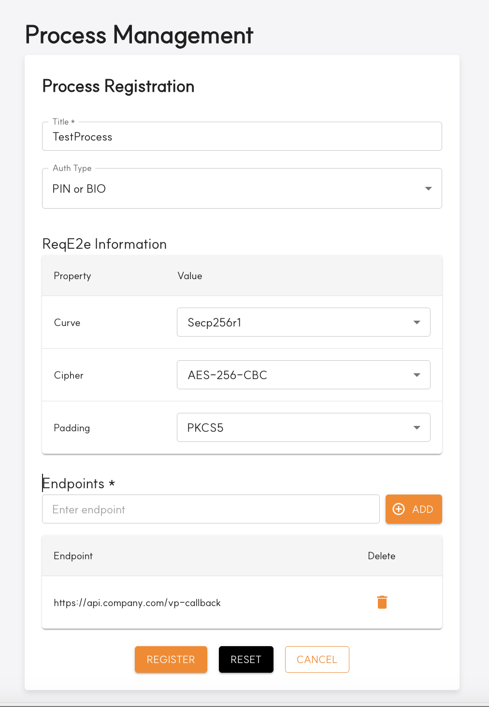
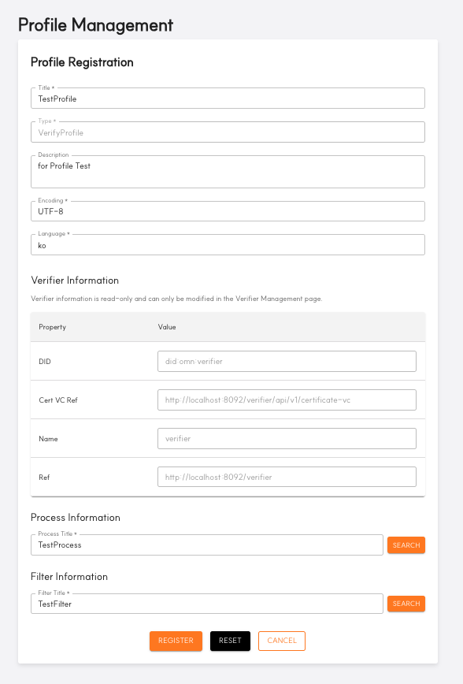

---
puppeteer:
    pdf:
        format: A4
        displayHeaderFooter: true
        landscape: false
        scale: 0.8
        margin:
            top: 1.2cm
            right: 1cm
            bottom: 1cm
            left: 1cm
    image:
        quality: 100
        fullPage: false
---

Open DID Verifier Admin Operation Guide
==

- Date: 2025-05-30
- Version: v2.0.0

Revision History
==
| Version | Date       | Changes                                    |
| ------- | ---------- | ------------------------------------------ |
| v1.0.0  | 2025-03-31 | Initial creation                          |
| v1.0.1  | 2025-04-25 | Added `3.1. Verifier Registration` section |
| v2.0.0  | 2025-05-30 | Added ZKP verification-related menus and functional changes |

Table of Contents
==
- [Revision History](#revision-history)
- [1. Table of Contents](#1-table-of-contents)
  - [1.1. Overview](#11-overview)
  - [1.2. Admin Console Definition](#12-admin-console-definition)
- [2. Basic Manual](#2-basic-manual)
  - [2.1. Login](#21-login)
  - [2.2. Main Screen Layout](#22-main-screen-layout)
  - [2.3. Menu Structure](#23-menu-structure)
    - [2.3.1. Verifier Unregistered State](#231-verifier-unregistered-state)
    - [2.3.2. Verifier Registration Complete State](#232-verifier-registration-complete-state)
    - [2.3.3. VP Policy Management Sub-menus](#233-vp-policy-management-sub-menus)
    - [2.3.4. ZKP Policy Management Sub-menus](#234-zkp-policy-management-sub-menus)
    - [2.3.5. Recommended Setup Order](#235-recommended-setup-order)
  - [2.4. Password Change Management](#24-password-change-management)
- [3. Detailed Feature Manual](#3-detailed-feature-manual)
  - [3.1. Verifier Management](#31-verifier-management)
    - [3.1.1. Verifier Registration Process](#311-verifier-registration-process)
    - [3.1.2. Registered Verifier Information Management](#312-registered-verifier-information-management)
    - [3.1.3. Troubleshooting Guide](#313-troubleshooting-guide)
  - [3.2. Service Configuration](#32-service-configuration)
    - [3.2.1. Service Configuration Overview](#321-service-configuration-overview)
    - [3.2.2. Service Registration / Modification](#322-service-registration--modification)
  - [3.3. VP Policy Management](#33-vp-policy-management)
    - [3.3.1. Filter Management](#331-filter-management)
      - [3.3.1.1. Filter Management Screen Layout](#3311-filter-management-screen-layout)
      - [3.3.1.2. Filter Registration / Modification](#3312-filter-registration--modification)
    - [3.3.2. Process Management](#332-process-management)
      - [3.3.2.1. Process Management Screen Layout](#3321-process-management-screen-layout)
      - [3.3.2.2. Process Registration / Modification](#3322-process-registration--modification)
    - [3.3.3. Profile Management](#333-profile-management)
      - [3.3.3.1. Profile Management Screen Layout](#3331-profile-management-screen-layout)
      - [3.3.3.2. Profile Registration / Modification](#3332-profile-registration--modification)
    - [3.3.4. Policy Management](#334-policy-management)
      - [3.3.4.1. Policy Management Screen Layout](#3341-policy-management-screen-layout)
      - [3.3.4.2. Policy Registration](#3342-policy-registration)
  - [3.4. ZKP Policy Management](#34-zkp-policy-management)
    - [3.4.1. Proof Request Configuration](#341-proof-request-configuration)
      - [3.4.1.1. Proof Request Register](#3411-proof-request-register)
    - [3.4.2. ZKP Profile Management](#342-zkp-profile-management)
      - [3.4.2.1. ZKP Profile Register](#3421-zkp-profile-register)
    - [3.4.3. ZKP Policy Management](#343-zkp-policy-management)
      - [3.4.3.1. ZKP Policy Register](#3431-zkp-policy-register)
  - [3.5. VP History Page](#35-vp-history-page)
  - [3.6. Admin Management](#36-admin-management)
    - [3.6.1. Admin List View](#361-admin-list-view)
    - [3.6.2. Admin Registration](#362-admin-registration)

## 1.1. Overview

This document provides a guide for the installation and operation of the Open DID Verifier Admin Console. It explains the basic manual and detailed feature manual of the Admin Console step by step, helping users to use it efficiently.

For a complete installation guide for OpenDID, please refer to the [Open DID Installation Guide].

<br/>

## 1.2. Admin Console Definition

The Verifier Admin Console is a web-based management tool for managing Verifier servers in the Open DID system. Through this tool, administrators can set up Verifiable Presentation (VP) and ZKP Credential verification policies, monitor verification requests and results, and manage system settings.

The Admin Console provides the following key features:

- **Verifier Basic Information Management**
  - Verifier server registration and status checking
- **Service(Payload) Basic Information Management**
  - Service(payload) registration and item configuration
- **VP Policy Item Management**
  - Profile Filter registration and management
  - Profile Process registration and management
  - VP Profile setup
  - VP Policy setup
- **ZKP Policy Item Management**
  - Proof Request registration and management
  - ZKP Profile registration and management
  - ZKP Policy setup
- **VP History**
  - VP verification history checking
- **Administrator Account Management**
  - Admin Console account management

# 2. Basic Manual

This chapter provides guidance on the basic usage of the Open DID Verifier Admin Console.

## 2.1. Login

To access the Admin Console, follow these steps:

1. Open a web browser and access the Verifier Admin Console URL.

   ```
   http://<verifier_domain>:<port>
   ```

2. On the login screen, enter the administrator account email and password.
   - Default administrator account: <admin@opendid.omnione.net>
   - Initial password: password (password change required on first login)

3. Click the 'Login' button.

> **Note**: For security reasons, a password change is required on first login.

<br/>

## 2.2. Main Screen Layout

The main screen displayed after login consists of the following elements:


| Number | Area | Description |
|--------|------|-------------|
| 1 | Settings Button | Clicking the 'SETTING' button navigates to a screen where you can change the password of the currently logged-in account. |
| 2 | Content Header | The title of the currently selected menu is displayed. The page name is shown for each menu. |
| 3 | Sidebar Menu | Lists menus for accessing major functions including Verifier Management. |
| 4 | User Information Area | Shows the email of the currently logged-in administrator (<admin@opendid.omnione.net>) and logout button. |

<br/>

## 2.3. Menu Structure

The sidebar menu of the Verifier Admin Console **differs in screen configuration depending on the Verifier registration status**. This reflects the phased setup procedure of the OpenDID system, guiding users to configure the system sequentially.

### 2.3.1. Verifier Unregistered State

In the initial state where the Verifier server is not yet registered, only the **Verifier Registration** item is displayed alone in the menu.


> **Important**: In the OpenDID system, the Verifier is a core element that forms the foundation of all verification policies. VP and ZKP verification policies can only be set up after Verifier registration is complete.

### 2.3.2. Verifier Registration Complete State

Once Verifier registration is complete, all management functions are activated, and the sidebar menu is configured as follows:


| Number | Menu Name | Function Description | Setup Order |
|--------|-----------|---------------------|-------------|
| 1 | **Verifier Management** | View and manage registered verifier information. DID Document viewing and status checking available. | ✅ Complete |
| 2 | **Service Configuration** | Manage service information to be used in VP and ZKP policies. Set verification type (VP/ZKP) and submission mode. | 🥇 Step 1 |
| 3 | **VP Policy Management** | Parent menu for managing policies for general VP verification. | 🥈 Step 2 |
| 4 | **ZKP Policy Management** | Parent menu for managing policies for ZKP (Zero-Knowledge Proof) verification. | 🥉 Step 3 |
| 5 | **VP History Page** | View VP and ZKP verification history submitted by users. | 📊 Monitoring |
| 6 | **Admin Management** | Manage administrator accounts with Admin Console access rights. | 🔐 Access Control |

### 2.3.3. VP Policy Management Sub-menus

When you click VP Policy Management, the following sub-menus are displayed:

| Sub-menu | Function Description | Setup Order |
|----------|---------------------|-------------|
| **Filter Management** | Define VC schema and claim conditions required for VP verification. | 2-1 |
| **Process Management** | Set encryption and authentication methods to be used during VP submission process. | 2-2 |
| **Profile Management** | Create VP verification profiles by combining Filter and Process. | 2-3 |
| **Policy Management** | Complete final VP verification policy by connecting Service and Profile. | 2-4 |

### 2.3.4. ZKP Policy Management Sub-menus

When you click ZKP Policy Management, the following sub-menus are displayed:

| Sub-menu | Function Description | Setup Order |
|----------|---------------------|-------------|
| **Proof Request Configuration** | Define attributes and predicates required for ZKP proof. | 3-1 |
| **ZKP Profile Management** | Create ZKP verification profiles including Proof Request. | 3-2 |
| **ZKP Policy Management** | Complete final ZKP verification policy by connecting Service and ZKP Profile. | 3-3 |

### 2.3.5. Recommended Setup Order

For efficient system configuration, we recommend setting up in the following order:

#### **Step 1: Basic Setup**
1. **Verifier Registration** - Register Verifier server and generate DID Document
2. **Service Configuration** - Register basic verification service information

#### **Step 2: VP Policy Setup** (For general VP verification)
1. **Filter Management** - Define VC schema and claim conditions
2. **Process Management** - Set encryption and authentication
3. **Profile Management** - Combine Filter + Process
4. **Policy Management** - Connect Service + Profile

#### **Step 3: ZKP Policy Setup** (For Zero-Knowledge Proof)
1. **Proof Request Configuration** - Define ZKP proof requirements
2. **ZKP Profile Management** - Create ZKP profile
3. **ZKP Policy Management** - Connect Service + ZKP Profile

#### **Step 4: Operation and Management**
- **VP History Page** - Monitor verification history
- **Admin Management** - Manage administrator accounts

> **Note**: VP and ZKP are different verification methods, so you can set up only the policies needed according to your service requirements.
> - **VP**: General identity verification (e.g., ID card, degree certificate)
> - **ZKP**: Privacy-important verification (e.g., age proof, income range proof)

<br/>

## 2.4. Password Change Management

User password changes can be performed through the following steps:

1. Click the 'SETTING' button in the header area.
2. Select 'Password Change' from the settings menu.
3. In the password change screen:
   - Enter current password
   - Enter new password
   - Confirm new password
4. Click the 'Save' button to apply changes.

> **Note**: Password must be between 8 and 64 characters.

<br/>

# 3. Detailed Feature Manual

This chapter provides detailed usage instructions for the main features of the Open DID Verifier Admin Console.

## 3.1. Verifier Management

Verifier Management is a core function responsible for registering and managing Verifier servers in the OpenDID system.

The Verifier is the entity that verifies VP (Verifiable Presentation) and ZKP Proof submitted by users, and is an important component that forms the foundation of all verification policies. Verifier registration is performed **only once** during initial system setup, and afterwards, you can view and manage the registered information.

### 3.1.1. Verifier Registration Process

Verifier registration is a step-by-step procedure to safely participate new verifiers in the OpenDID ecosystem. It proceeds through a total of **3 sequential steps**.

#### **Overall Registration Flow**
```
Step 1: Enter Verifier basic information and connection test
     ↓
Step 2: Generate DID Document and request TA registration
     ↓ (2-1: Generate → 2-2: Request → 2-3: Check approval)
     ↓
Step 3: Entity registration and membership certificate issuance
     ↓
Registration Complete: Move to Verifier Management menu
```

---

#### **Step 1 - Enter Verifier Basic Information**

In the first step, enter the basic information of the Verifier server and check actual connectivity.


| Input Item | Description | Input Example | Required |
|------------|-------------|---------------|----------|
| **Name** | Enter the unique name of the Verifier server. | `MyCompany-Verifier` | ✅ Required |
| **Verifier URL** | Enter the access URL of the Verifier server. | `http://192.168.1.100:8094/verifier` | ✅ Required |

##### **Connection Test Function**
- Click the **Test Connection** button to check if actual connection is possible with the entered URL.
- The **NEXT** button is activated to proceed to the next step only when connection is successful.
- If connection fails, recheck the URL and verify that the Verifier server is running properly.

> **Note**: The Verifier URL format must be in the form `http://<IP or domain>:<port>/verifier`.

---

#### **Step 2 - DID Document Registration**

The second step is the process of registering the Verifier's identity on the blockchain, consisting of **3 detailed steps**.

> **Important**: Once created, DID Documents **cannot be modified or re-registered**. Please proceed carefully.

##### **Step 2-1: DID Document Generation**

Automatically generates a unique DID Document for the Verifier server.


| Button | Function | Result |
|--------|----------|--------|
| **GENERATE** | Automatically generate Verifier DID Document | Generate JSON document including DID, public key, and service endpoint |

- Upon successful generation, a green message appears and the Step 2-2 area is automatically displayed.
- The generated DID Document includes the following information:
  - **DID**: Distributed identity identifier in the form `did:omn:verifier:<unique identifier>`
  - **Public Key**: Cryptographic key information for verification
  - **Service Endpoint**: Access point information for the Verifier server

##### **Step 2-2: TA Admin Registration Request**

Request registration of the generated DID Document to the Trust Authority (TA).


| Button | Function | Description |
|--------|----------|-------------|
| **REQUEST** | Send DID registration request to TA Admin | Create a request that requires manual approval from TA administrator |

- Upon successful request, a green message appears and the Step 2-3 area is automatically displayed.
- After this step, you need to wait for approval from the TA administrator.

##### **Step 2-3: Check Approval Status**

Check whether the TA administrator has approved the DID Document registration request.


| Button | Function | Result by Status |
|--------|----------|------------------|
| **CHECK** | Query TA approval status | **Approved**: Green message + NEXT button activated<br>**Rejected**: Red message + reason displayed |

> **TA Administrator approval process** is an essential process for the security of the OpenDID ecosystem. Please check the status regularly until approval is complete.

---

#### **Step 3 - Entity Registration and Membership Certificate Issuance**

In the final step, register the Verifier as an official member (Entity) of the OpenDID ecosystem and receive a membership certificate.


This step automatically executes **TA Protocol P132 (User Registration Protocol)** to perform the following processes:

1. **Entity Registration Request**: Register Verifier as Entity on TA server
2. **Certificate Issuance**: Generate and receive membership certificate (Certificate VC)
3. **Wallet Key Management**: Securely store Verifier's private/public key pair

| Button | Function | Processing Content |
|--------|----------|-------------------|
| **REQUEST** | Execute Entity registration protocol | Automatically execute TA Protocol P132 |
| **FINISH** | Complete registration and move to main screen | Switch to Verifier Management screen |

> The membership certificate (Certificate VC) is a digital certificate that proves the Verifier is a trustworthy verifier. It is used to prove the Verifier's identity in all subsequent verification processes.

---

### 3.1.2. Registered Verifier Information Management

Once Verifier registration is complete, you can view detailed information of the registered Verifier in the **Verifier Management** menu.


#### **Information View Screen Layout**

| Item | Display Content | Description |
|------|----------------|-------------|
| **DID** | `did:omn:verifier:<identifier>` | Unique distributed identity identifier of the Verifier |
| **Name** | Name entered during registration | Verifier name displayed to users during VP verification |
| **Status** | `ACTIVATE` / `DEACTIVATE` | Current activation status of the Verifier |
| **URL** | Verifier service base URL | Access point for processing verification requests |
| **Certificate URL** | Membership certificate view URL | Link to access Certificate VC |
| **Registered At** | Registration completion date/time | Date and time when Verifier was registered in the system |

#### **DID Document Detailed View**

Click the **VIEW DID DOCUMENT** button to view the complete DID Document registered on the blockchain.

**Viewable Information:**
- **@context**: JSON-LD context of the DID Document
- **id**: Verifier DID identifier
- **controller**: Information about the entity controlling the DID
- **created**: DID Document creation date/time
- **updated**: Last update date/time
- **verificationMethod**: Public key information for signature verification
- **service**: Verifier service endpoint information

> **Note**: DID Documents are permanently recorded on the blockchain, making them tamper-proof and verifiable by all participants in the OpenDID ecosystem.

---

### 3.1.3. Troubleshooting Guide

#### **Connection Test Failure**
- Check if the Verifier server is running properly
- Verify that ports are not blocked by firewall settings
- Confirm URL format is correct (`http://IP:PORT/verifier`)

#### **DID Registration Approval Delay**
- Contact TA administrator about approval request status
- Periodically click CHECK button to verify status
- If approval is rejected, check the reason and resolve issues before retrying

#### **Entity Registration Failure**
- Check network connection status
- Verify TA server status
- Check Verifier server logs for error messages

> **Important**: If problems occur during the Verifier registration process, you may need to start over from the beginning. Please perform each step carefully.

## 3.2. Service Configuration

Service Configuration is a function that defines and manages service information to be used in VP and ZKP verification policies.

Service is **a core component that defines the purpose and method of verification requests**, telling users what type of verification is required and providing endpoints to process results after verification completion. All VP and ZKP policies must be connected to one service, so it must be configured first before setting up policies.

### 3.2.1. Service Configuration Overview

The Service Configuration menu allows you to manage the entire lifecycle of services.


#### **Screen Components**

| Number | Component | Function Description | Permission |
|--------|-----------|---------------------|------------|
| 1 | **REGISTER Button** | Navigate to page for registering new service. | All administrators |
| 2 | **UPDATE Button** | Modify information of selected service. | All administrators |
| 3 | **DELETE Button** | Delete selected service. | All administrators |
| 4 | **Service List** | Display summary information of all registered services. | View only |
| 5 | **Pagination** | Navigate large service lists by pages. | View only |

#### **Service List Information**

| Column | Display Content | Description |
|--------|----------------|-------------|
| **Service Name** | Service unique name | Link that navigates to detail page when clicked |
| **Device** | Supported device type | PC, Mobile, Tablet, etc. |
| **Lock Status** | Service lock status | `locked` / `unlocked` (currently only `unlocked` supported) |
| **Submission Mode** | VP submission method | `Direct` / `Indirect` / `Proxy` |
| **Verification Type** | Verification type | `VP` (general verification) / `ZKP` (zero-knowledge proof) |
| **Policy Count** | Number of connected policies | Number of policies using this service |

> **Important**: Services with Policy Count of 1 or more cannot be deleted. To delete, you must first remove all connected policies.

---

### 3.2.2. Service Registration / Modification

Click the **REGISTER** button to register a new service and navigate to the service registration page.
The same screen layout is used when **UPDATE** modifying services.


#### **Required Input Items**

| Item | Description | Input Example | Constraints |
|------|-------------|---------------|-------------|
| **Service*** | Unique name of the service | `IDCardVerification`, `AgeProof` | Only English, numbers, hyphens, underscores allowed |
| **Device*** | Supported device type | `PC`, `Mobile`, `Tablet` | Free text input |
| **Lock Status*** | Service lock status | `Unlocked` | Currently only `Unlocked` selectable |
| **Submission Mode*** | VP submission method selection | `Direct`, `Indirect` | Select from dropdown |
| **Verification Type*** | Verification type selection | `VP`, `ZKP` | Select according to verification method to use |

> **Note**: * indicates required input items.

#### **Submission Mode Details**

| Mode | Description | When to Use |
|------|-------------|-------------|
| **Direct** | User submits VP directly to Verifier | When real-time verification is needed | 
| **Indirect** | VP delivery through intermediate server | In network-constrained environments |
| **Proxy** | Indirect delivery through proxy server | Complex network configurations | 

#### **Verification Type Details**

| Type | Description | Use Cases | Privacy Exposure |
|------|-------------|-----------|------------------|
| **VP** | General VP verification method | ID verification, education verification, qualification verification | Selective disclosure of necessary information only |
| **ZKP** | Zero-knowledge proof based verification | Age proof, income range proof, residence proof | Minimum information proof only |

#### **Endpoints Management**

Section for managing endpoint URLs to be connected with the service.

| Function | Description | URL Format Example |
|----------|-------------|-------------------|
| **ADD ENDPOINT** | Add new endpoint URL | `https://api.example.com/verify` |
| **Delete (🗑️)** | Remove registered endpoint | Click trash icon in each row |

#### **Registration Button Functions**

| Button | Function | Action |
|--------|----------|--------|
| **REGISTER** | Register service with entered information | Create service after validation and navigate to list page |
| **RESET** | Initialize all input fields | Clear all entered content and return to default values |
| **CANCEL** | Cancel registration and navigate to previous page | Return to service list without saving input content |

---

## 3.3. VP Policy Management

VP Policy Management is a function that configures and manages policies for general VP (Verifiable Presentation) verification. VP policies are configured step by step in the order **Filter → Process → Profile → Policy**, with each step's settings forming the foundation for the next step.

VP verification is a method where users selectively disclose necessary information from their owned VCs (Verifiable Credentials) to prove their identity, mainly used for ID verification, education verification, qualification verification, etc.

### 3.3.1. Filter Management

Filter is a core component that determines "what VCs to require from users?", defining VC schema ID, required claims, allowed issuers, etc. Since all VP Profiles must be connected to at least one Filter, it must be set up as the first step in VP policy configuration.

#### **3.3.1.1 Filter Management Screen Layout**


| Number | Component | Function Description | When to Use |
|--------|-----------|---------------------|-------------|
| 1 | **REGISTER Button** | Navigate to page for registering new Filter | When creating new Filter |
| 2 | **UPDATE Button** | Modify selected Filter information | When changing existing Filter |
| 3 | **DELETE Button** | Delete selected Filter | When removing unnecessary Filter |
| 4 | **Filter List** | Display summary information of all registered Filters | Understanding Filter status |
| 5 | **Search and Paging** | Filter search and page-by-page navigation | Managing large amounts of data |

---

#### **3.3.1.2. Filter Registration / Modification**

Click the **REGISTER** button to register a new Filter and navigate to the Filter registration page.
The same screen layout is used when **UPDATE** modifying Filters.


##### **Basic Information Input**

| Item | Description | Input Example | Required |
|------|-------------|---------------|----------|
| **Title*** | Unique title of the Filter | `National_ID_Filter`, `Driver_License_Filter` | ✅ Required |
| **Type** | Schema type selection | `OsdSchemaCredential` | ✅ Required (fixed value) |
| **Present All** | Whether all claims submission is required | `true` | ✅ Required (fixed value) |

**Present All Setting Guide:**
- **true**: All claims in the schema must be submitted (fixed value)
- **false**: Only claims specified in Required Claims need to be submitted (selectable during implementation)

##### **VC Schema Search and Selection**

Since Filter operates based on specific VC schemas, you must first select the schema to use for verification.


| Function | Description | Usage |
|----------|-------------|-------|
| **SEARCH Button** | Query schema list from List operator and select | Displays schema selection dialog when clicked |

**Information available in schema selection dialog:**
- **Schema Title**: Human-readable schema name
- **Schema ID**: Unique schema identifier provided by List operator

##### **Required Claims Management**

Define claims that must be submitted during verification.

| Function | Description | Operation Method |
|----------|-------------|------------------|
| **Claims List** | Currently set required claims | Display name and data type of each claim |

**Claim Selection Process:**
1. Click **SEARCH** button
2. Display **Schema Selection Dialog**
3. **Check schema** selection and confirm
4. **Claims based on selected schema are automatically added**

##### **Display Claims Management**

Set claim information to be displayed to users. Display Claims are managed separately from Required Claims and serve to clearly inform users what information is required during the verification process. (For implementation purposes, values are identical to Required Claims.)

##### **Allowed Issuers Management**

You can restrict the issuers of VCs submitted through this Filter.

| Function | Description | Input Format |
|----------|-------------|--------------|
| **ADD Button** | Add new allowed issuer DID | DID format: `did:omn:issuer:xxx` |
| **Issuer DID List** | List of currently allowed issuers' DIDs | Display verification authority for each DID |
| **Delete (🗑️)** | Remove specific issuer from allowed list | Click trash icon in corresponding DID row |

##### **Registration Completion**

Once all information input is complete, use the following buttons to finalize registration.

| Button | Function | Action Result |
|--------|----------|---------------|
| **REGISTER** | Register Filter with entered information | Create Filter after validation and navigate to list page |
| **UPDATE** | Modify selected Filter information | When changing existing Filter |
| **RESET** | Initialize all input fields | Clear all entered content and return to default values |
| **CANCEL** | Cancel registration and navigate to previous page | Return to Filter list without saving input content |

---

### 3.3.2. Process Management

Process Management is a function that defines **encryption methods and authentication procedures to be used during VP submission process**.

Process is a core component that determines "how to secure the VP submission process?", defining user authentication methods (PIN/biometric authentication), data encryption settings, and endpoints to process results after verification completion. If Filter defines "what" to verify, Process defines "how" to verify securely.

#### **3.3.2.1. Process Management Screen Layout**


| Number | Component | Function Description | When to Use |
|--------|-----------|---------------------|-------------|
| 1 | **REGISTER Button** | Navigate to page for registering new Process | When creating new Process |
| 2 | **UPDATE Button** | Modify selected Process information | When changing existing Process |
| 3 | **DELETE Button** | Delete selected Process | When removing unnecessary Process |
| 4 | **Process List** | Display summary information of all registered Processes | Understanding Process status |
| 5 | **Search and Paging** | Process search and page-by-page navigation | Managing large amounts of data |

#### **Process List Information**

| Column | Display Content | Description |
|--------|----------------|-------------|
| **Title** | Unique title of the Process | Name identifiable by administrators |
| **Auth Type** | User authentication method | `PIN` (pin number) / `BIO` (biometric authentication) |
| **Curve** | Elliptic curve cryptography algorithm | `Secp256r1` and other cryptographic standards |
| **Cipher** | Symmetric key encryption algorithm | `AES-128-CBC`, `AES-256-CBC`, etc. |
| **Padding** | Padding method | `PKCS5`, `PKCS7`, etc. |
| **Created At** | Creation date/time | Date and time when Process was first registered |

> **Important**: Processes with Profile Count of 1 or more cannot be deleted. To delete, you must first remove the corresponding Process from all connected Profiles.

---

#### **3.3.2.2. Process Registration / Modification**

Click the **REGISTER** button to register a new Process and navigate to the Process registration page.</br>
The same screen layout is used when **UPDATE** modifying Processes.



##### **Basic Information Input**

| Item | Description | Input Example | Required |
|------|-------------|---------------|----------|
| **Title*** | Unique title of the Process | `Biometric_Authentication_Process` | ✅ Required |
| **Auth Type*** | User authentication method selection | `PIN or BIO` | ✅ Required (fixed value) |

##### **ReqE2e Information (End-to-End Encryption Settings)**

Set encryption algorithms and methods to be used during VP submission process.

| Encryption Component | Description | Supported Options | Required |
|---------------------|-------------|-------------------|----------|
| **Curve*** | Elliptic curve cryptography algorithm | `Secp256r1` | ✅ Required `Secp256r1` (fixed value) |
| **Cipher*** | Symmetric key encryption algorithm | `AES-256-CBC` | ✅ Required `AES-256-CBC` (fixed value) |
| **Padding*** | Block encryption padding method | `PKCS5` | ✅ Required `PKCS5` (fixed value) |

##### **Endpoints Management**

Set external endpoints to handle events occurring during Process execution.

| Function | Description | URL Format Example |
|----------|-------------|-------------------|
| **ADD Button** | Add new endpoint URL | `https://api.company.com/vp-callback` |
| **Endpoint List** | Display all currently registered URLs | Can check purpose and status of each URL |
| **Delete Column** | Remove specific endpoint | Click Delete button in corresponding row |

##### **Registration Completion**

Once all information input is complete, use the following buttons to finalize registration.

| Button | Function | Action Result |
|--------|----------|---------------|
| **REGISTER** | Register Process with entered information | Create Process after encryption settings validation and navigate to list page |
| **UPDATE** | Modify selected Process information | When changing existing Process |
| **RESET** | Initialize all input fields | Clear all entered content and return to default values |
| **CANCEL** | Cancel registration and navigate to previous page | Return to Process list without saving input content |

---

### 3.3.3. Profile Management

Profile Management is a function that **combines previously defined Filter and Process to create complete VP verification profiles**.

Profile is an integrated component that defines "what VC to verify in what way?", combining Filter (verification target) and Process (verification method) to complete the verification experience to be provided to users. Since Profile is the direct foundation for final Policy creation, it is a core step in VP policy configuration.

#### **3.3.3.1. Profile Management Screen Layout**


| Number | Component | Function Description | When to Use |
|--------|-----------|---------------------|-------------|
| 1 | **REGISTER Button** | Navigate to page for registering new Profile | When creating new Profile |
| 2 | **UPDATE Button** | Modify selected Profile information | When changing existing Profile |
| 3 | **DELETE Button** | Delete selected Profile | When removing unnecessary Profile |
| 4 | **Profile List** | Display summary information of all registered Profiles | Understanding Profile status |
| 5 | **Search and Paging** | Profile search and page-by-page navigation | Managing large amounts of data |

#### **Profile List Information**

| Column | Display Content | Description |
|--------|----------------|-------------|
| **Profile Title** | Unique title of the Profile | Name for administrator identification |
| **Profile Description** | Profile description | Description of purpose and characteristics |
| **Created At** | Registration date/time | Date and time when first registered |

> **Warning**: Profiles already registered in Policy Management cannot be deleted. To delete, you must first remove the corresponding profile from connected Policies.

---

#### **3.3.3.2. Profile Registration / Modification**

Click the **REGISTER** button to register a new Profile and navigate to the Profile registration page.
The same screen layout is used when **UPDATE** modifying Profiles.



##### **Basic Information Input**

| Item | Description | Input Example | Required |
|------|-------------|---------------|----------|
| **Title*** | Unique title of the Profile | `Degree_Verification_General_Profile` | ✅ Required |
| **Type** | Profile type | `VerifyProfile` | ✅ Required (fixed value) |
| **Description*** | Detailed description of the Profile | `Profile for ID verification` | ✅ Required |
| **Encoding*** | Character encoding method | `UTF-8` | ✅ Required |
| **Language*** | Supported language | `ko` (Korean), `en` (English) | ✅ Required |

##### **Verifier Information (Automatic Setup)**

Verifier information is automatically entered through the membership certificate and cannot be modified.

| Information Item | Auto-set Content | Source |
|-----------------|------------------|--------|
| **Verifier DID** | `did:omn:verifier:<identifier>` | DID generated during Verifier registration |
| **Verifier Name** | Registered Verifier name | Name set in Verifier Management |
| **Certificate URL** | Membership certificate access URL | Certificate VC location issued by TA |

> **Note**: This information is important trust information that tells users "who is requesting verification?" during VP verification.

##### **Process Information Selection**

Select the Process to connect to the Profile.


| Function | Description | Selection Criteria |
|----------|-------------|-------------------|
| **Process Selection Field** | Display name of currently selected Process | Read-only field |
| **Search Button** | Open Process search dialog | Select from all registered Processes |

##### **Filter Information Selection**

Select the Filter to connect to the Profile.


| Function | Description | Selection Criteria |
|----------|-------------|-------------------|
| **Filter Selection Field** | Display name of currently selected Filter | Read-only field |
| **Search Button** | Open Filter search dialog | Select from all registered Filters |

##### **Registration Completion**

Once all information input is complete, use the following buttons to finalize registration.

| Button | Function | Action Result |
|--------|----------|---------------|
| **REGISTER** | Register Profile with entered information | Create Profile after Filter/Process combination validation and navigate to list page |
| **RESET** | Initialize all input fields | Clear all entered content and return to default values (including selected Filter/Process) |
| **CANCEL** | Cancel registration and navigate to previous page | Return to Profile list without saving input content |

### 3.3.4. Policy Management

Policy Management is a function that **connects previously configured Service and Profile to create complete VP verification policies**.

Policy is the final step in VP policy configuration, defining "what service to verify in what way?" as executable verification rules. It combines Service (verification purpose and result processing) and Profile (verification target and method) to complete the entire verification workflow that actual users will experience. Generated Policies are core components directly referenced when external systems request VP verification.

#### **3.3.4.1. Policy Management Screen Layout**


| Number | Component | Function Description | When to Use |
|--------|-----------|---------------------|-------------|
| 1 | **REGISTER Button** | Navigate to page for registering new Policy | When creating new Policy |
| 2 | **UPDATE Button** | Modify selected Policy information | When changing existing Policy |
| 3 | **DELETE Button** | Delete selected Policy | When removing unnecessary Policy |
| 4 | **Policy List** | Display summary information of all registered Policies | Understanding Policy status |
| 5 | **Search and Paging** | Policy search and page-by-page navigation | Managing large amounts of data |

#### **Policy List Information**

| Column | Display Content | Description |
|--------|----------------|-------------|
| **Policy Title** | Unique title of the Policy | Name for administrator identification |
| **Service Name** | Connected Service name | Service used by this Policy |
| **Profile Title** | Connected Profile name | Profile used by this Policy |
| **Created At** | Registration date/time | Date and time when first registered |

> **Warning**: Policies currently in use cannot be deleted. Check usage status before deletion.

---

#### **3.3.4.2. Policy Registration**

Click the **REGISTER** button to register a new Policy and navigate to the Policy registration page.


##### **Basic Information Input**

| Item | Description | Input Example | Required |
|------|-------------|---------------|----------|
| **Policy Title*** | Unique title of the Policy | `ID_Verification_Policy`, `Employee_Access_Policy` | ✅ Required |

##### **Profile Information Selection**

Select the Profile to connect to the Policy.


| Function | Description | Selection Criteria |
|----------|-------------|-------------------|
| **Profile Selection Field** | Display name of currently selected Profile | Read-only field |
| **SEARCH Button** | Open Profile search dialog | Select from all registered Profiles |

**Information available in Profile selection dialog:**
- **Profile Title**: Name and purpose of the profile

##### **Payload Information Selection**

Select the Service to connect to the Policy.


| Function | Description | Selection Criteria |
|----------|-------------|-------------------|
| **Payload Selection Field** | Display name of currently selected Service | Read-only field |
| **SEARCH Button** | Open Service search dialog | Select from all registered Services |

**Information available in Service (Payload) selection dialog:**
- **Title**: Name and purpose of the service

##### **Registration Completion**

Once all information input is complete, use the following buttons to finalize registration.

| Button | Function | Action Result |
|--------|----------|---------------|
| **REGISTER** | Register Policy with entered information | Create Policy after Service/Profile compatibility validation and navigate to list page |
| **RESET** | Initialize all input fields | Clear all entered content and return to default values |
| **CANCEL** | Cancel registration and navigate to previous page | Return to Policy list without saving input content |

---
<br/>

## 3.4. ZKP Policy Management

ZKP Policy Management is a menu for managing ZKP (Zero-Knowledge Proof) policies. It consists of multiple sub-menus, each managing specific aspects of ZKP policy.

### 3.4.1. Proof Request Configuration

The Proof Request Configuration menu allows you to register, modify, and delete proof request information used for ZKP verification.


Proof Request Configuration screen provides the following main functions:
- REGISTER: Register new proof request.
- UPDATE: Modify selected proof request (activated when item is selected).
- DELETE: Delete selected proof request (activated when item is selected).

The proof request list table displays information such as Name, Version, Profile Count, Registered At, Updated At, and you can navigate multiple pages of data through pagination functionality.

#### 3.4.1.1 Proof Request Register

The proof request registration page allows you to input information for registering new proof requests. This page also uses the same form when modifying proof requests.


| Number | Item | Description |
|--------|------|-------------|
| 1 | Name | Field for entering the name of the proof request. "zkpProofRequest" is entered as an example. |
| 2 | Version | Enter the version of the proof request. "1.0" is entered as an example. |
| 3 | Curve | Select the elliptic curve algorithm to use. You can select options like "SECP-256-R1" from the dropdown menu. |
| 4 | Cipher | Select the encryption algorithm. You can select options like "AES-256-CBC" from the dropdown menu. |
| 5 | Padding | Select the padding method. You can select options like "PKCS5" from the dropdown menu. |
| 6 | Requested Attributes | Section for managing attributes to request. Click the "ADD ATTRIBUTE" button to add attributes by selecting schemas from a popup. Each attribute consists of Attribute Name and Credential Definition. To delete an entered attribute, click the trash icon on the right of the corresponding item. |
| 7 | Requested Predicates | Section for managing predicates to request. Click the "ADD ATTRIBUTE" button to add attributes by selecting schemas from a popup. Each predicate consists of Attribute Name, Predicate Type, Predicate Value, and Credential Definition. To delete an entered predicate, click the trash icon on the right of the corresponding item. |
| 8 | Button Area | - UPDATE: Modify proof request with entered information.<br>- RESET: Initialize all input fields. In modification mode, revert to existing input values.<br>- CANCEL: Cancel input and return to previous page (proof request list). |

 > **Note**: For detailed information about data used in ZKP verification, please refer to the Data Specification document.

### 3.4.2. ZKP Profile Management

The ZKP Profile Management menu allows you to manage ZKP profile information. In this screen, you can check the profile list and perform registration, modification, and deletion operations.


ZKP Profile Management screen provides the following main functions:
- REGISTER: Register new ZKP profile.
- UPDATE: Modify selected ZKP profile (activated when item is selected).
- DELETE: Delete selected ZKP profile (activated when item is selected).

The ZKP profile list table displays information such as Profile ID, Profile Title, Profile Description, Used in Policies, Registered At, Updated At, and you can navigate multiple pages of data through pagination functionality.

> **Warning**: Profiles already registered in ZKP Policy Management cannot be deleted. To delete, you must first remove the corresponding profile from connected Policies.

#### 3.4.2.1 ZKP Profile Register

The ZKP profile registration page allows you to input information for registering new ZKP profiles. This page also uses the same form when modifying profiles.


| Number | Item | Description |
|--------|------|-------------|
| 1 | Title | Field for entering the title of the ZKP profile. "ZKPTestProfile" is entered as an example. |
| 2 | Description | Field for entering description of the ZKP profile. "Test for ZKP Proof Verification" is entered as an example. |
| 3 | Encoding | Select the encoding method used in the profile. You can select options like "UTF-8" from the dropdown menu. |
| 4 | Language | Select the profile language. You can select options like "English" from the dropdown menu. |
| 5 | Proof Request | Select the Proof Request to connect to the profile. You can select registered proof requests like "zkpProofRequest" from the dropdown menu. |
| 6 | Button Area | - REGISTER: Register ZKP profile with entered information.<br>- RESET: Initialize all input fields. In modification mode, revert to existing input values.<br>- CANCEL: Cancel input and return to previous page (ZKP profile list). |

### 3.4.3. ZKP Policy Management

The ZKP Policy Management menu allows you to comprehensively manage entire ZKP policies. In this screen, you can check the policy list and perform registration, modification, and deletion operations.


ZKP Policy Management screen provides the following main functions:
- REGISTER: Register new ZKP policy.
- UPDATE: Modify selected ZKP policy (activated when item is selected).
- DELETE: Delete selected ZKP policy (activated when item is selected).

The ZKP policy list table displays information such as Policy Title, Payload Service, Profile Title, Created At, and you can navigate multiple pages of data through pagination functionality.

ZKP policy is an important element for ZKP verification, defining the entire ZKP verification process by connecting ZKP Profile and Service.

#### 3.4.3.1 ZKP Policy Register

The ZKP policy registration page allows you to input information for registering new ZKP policies. This page also uses the same form when modifying policies.


ZKP policy registration screen consists of the following items:

| Number | Item | Description |
|--------|------|-------------|
| 1 | Policy Title | Field for entering the title of the ZKP policy. "ZKPPolicy" is entered as an example. |
| 2 | Profile Information | Select ZKP profile information to connect to the policy. Click the "SEARCH" button to display the ZKP profile search popup, and the selected profile after search is automatically entered in this field. |
| 3 | Payload Information | Select service information to use in the policy. Click the "SEARCH" button to display the service search popup, and the selected service after search is automatically entered in this field. |
| 4 | Button Area | - SAVE: Save ZKP policy with entered information.<br>- RESET: Initialize all input fields. In modification mode, revert to existing input values.<br>- CANCEL: Cancel input and return to previous page (ZKP policy list). |

Main components required for ZKP policy registration are as follows:
- Policy Title: Unique name of the ZKP policy
- Profile: Profile information for ZKP verification
- Payload Service: Service information to be used when requesting ZKP

<br/>

### 3.5. VP History Page

The VP History Page menu allows you to view the history of VP (Verifiable Presentation) submitted by users. In this screen, you can check the status and detailed information of each VP submission attempt, and track not only successful submissions but also failed or ongoing requests.


VP History Page provides the following main functions and information:

| Number | Item | Description |
|--------|------|-------------|
| 1 | VP Submit List | Title of VP submission list. |
| 2 | Transaction Status Filter | Filter only VP submissions of specific status (All, Completed, Pending, Failed) through dropdown menu. |
| 3 | List Header | Headers for VP submission information such as Transaction Status, Transaction ID, Holder DID, Created At. |
| 4 | Status Display | Distinguish VP submission status by color. Completed cases are displayed as green background 'Completed', pending cases as yellow background 'Pending', failed cases as red background 'Failed'. |
| 5 | Transaction ID | Unique transaction identifier for each VP submission attempt is displayed. All status requests can be tracked through this. |
| 6 | DID Information | Holder DID (DID of user who submitted VP) and submission time (Created At) for each VP submission case are displayed. For ZKP, this value is entered as an arbitrary value of "ZKP holder DID". For Pending or Failed status, it is displayed as "N/A". |
| 7 | Pagination | Select the number of rows to display per page and navigate between pages. In the example, 1-10 out of 87 total cases are displayed. |

Through VP history, administrators can perform the following tasks:
- Understanding VP submission status of specific status (Completed, Pending, Failed)
- Viewing VP submission history of specific user (Holder DID)
- Problem tracking and debugging through Transaction ID of failed requests

## 3.6. Admin Management

The `Admin Management` menu is a function for managing administrator accounts that can access the Verifier Admin Console.

When you install the Verifier server, the `admin@opendid.omnione.net` account is automatically created with ROOT privileges by default.
This account is the only ROOT account in the system and cannot be deleted.

Administrator accounts are divided into two privilege types: **ROOT** and **Normal Admin**.
ROOT accounts can perform all functions in the `Admin Management` menu, while Normal Admin can only perform general inquiry functions.

---
> **Note:** Currently, the privilege difference between ROOT accounts and Normal Admin accounts is
> only the difference in buttons displayed in the `Admin Management` menu (only Root can REGISTER / DELETE / CHANGE PASSWORD).
> Access privileges or functional restrictions for other menus in the system are not yet applied.
---

<br/>

## 3.6.1 Admin List View

When you enter the `Admin Management` menu, the list of registered administrator accounts is displayed in table format.


| Number | Item                    | Description                                                             |
| ------ | ----------------------- | ----------------------------------------------------------------------- |
| 1      | **REGISTER Button**     | Navigate to registration page where you can register new administrator account. |
| 2      | **DELETE Button**       | Delete selected administrator account. (Only ROOT administrator can do this) |
| 3      | **CHANGE PASSWORD Button** | Change password of selected administrator account.                    |
| 4      | **ID**                  | Email ID of registered administrator account.                          |
| 5      | **Role**                | Role of the administrator account (e.g., ROOT, Normal Admin, etc.)     |
| 6      | **Registered At**       | Date and time when the account was first registered.                   |
| 7      | **Updated At**          | Date and time when last modified.                                      |

<br/>

## 3.6.2. Admin Registration

Click the **REGISTER** button in the `Admin Management` screen to navigate to the registration screen as shown below.


| Number | Item                        | Description                                                                |
| ------ | --------------------------- | -------------------------------------------------------------------------- |
| 1      | **ID**                      | ID of administrator account to register. Must use email format.           |
| 2      | **Check Availability Button** | Check if entered ID is not duplicated.                                   |
| 3      | **Role**                    | Select privileges of administrator account to register (e.g., Normal Admin) |
| 4      | **Password**                | Enter password to use for login.                                          |
| 5      | **Re-enter Password**       | Enter password again to check for match.                                  |
| 6      | **REGISTER Button**         | Register administrator account based on entered information.               |
| 7      | **RESET Button**            | Initialize all input values.                                              |
| 8      | **CANCEL Button**           | Cancel registration and return to previous screen.                        |

[Open DID Installation Guide]: https://github.com/OmniOneID/did-release/blob/develop/release-V2.0.0.0/OpenDID_Installation_Guide-V2.0.0.0_ko.md