---
puppeteer:
    pdf:
        format: A4
        displayHeaderFooter: true
        landscape: false
        scale: 0.8
        margin:
            top: 1.2cm
            right: 1cm
            bottom: 1cm
            left: 1cm
    image:
        quality: 100
        fullPage: false
---

Open DID Verifier Admin Operation Guide
==

- Date: 2025-05-30
- Version: v2.0.0

개정 이력
==
| 버전   | 일자       | 변경 내용                  |
| ------ | ---------- | -------------------------- |
| v1.0.0 | 2025-03-31 | 최초 작성                  |
| v1.0.1 | 2025-04-25 | `3.1. Verifier Registration` 장 추가 |
| v2.0.0 | 2025-05-30 | ZKP 검증관련 메뉴 추가 및 기능 변경 반영 |

목차
==
- [개정 이력](#개정-이력)
- [1. 목차](#1-목차)
  - [1.1. 개요](#11-개요)
  - [1.2. Admin Console 정의](#12-admin-console-정의)
- [2. 기본 메뉴얼](#2-기본-메뉴얼)
  - [2.1. 로그인](#21-로그인)
  - [2.2. 메인 화면 구성](#22-메인-화면-구성)
  - [2.3. 메뉴 구성](#23-메뉴-구성)
    - [2.3.1. Verifier 미등록 상태](#231-verifier-미등록-상태)
    - [2.3.2. Verifier 등록 완료 상태](#232-verifier-등록-완료-상태)
    - [2.3.3. VP Policy Management 하위 메뉴](#233-vp-policy-management-하위-메뉴)
    - [2.3.4. ZKP Policy Management 하위 메뉴](#234-zkp-policy-management-하위-메뉴)
    - [2.3.5. 권장 설정 순서](#235-권장-설정-순서)
  - [2.4. 비밀번호 변경 관리](#24-비밀번호-변경-관리)
- [3. 기능별 상세 메뉴얼](#3-기능별-상세-메뉴얼)
  - [3.1. Verifier Management](#31-verifier-management)
    - [3.1.1. Verifier 등록 프로세스](#311-verifier-등록-프로세스)
    - [3.1.2. 등록된 Verifier 정보 관리](#312-등록된-verifier-정보-관리)
    - [3.1.3. 문제 해결 가이드](#313-문제-해결-가이드)
  - [3.2. Service Configuration](#32-service-configuration)
    - [3.2.1. Service Configuration 개요](#321-service-configuration-개요)
    - [3.2.2. 서비스 등록 / 수정](#322-서비스-등록--수정)
  - [3.3. VP Policy Management](#33-vp-policy-management)
    - [3.3.1. Filter Management](#331-filter-management)
      - [3.3.1.1. Filter Management 화면 구성](#3311-filter-management-화면-구성)
      - [3.3.1.2. Filter 등록 / 수정](#3312-filter-등록--수정)
    - [3.3.2. Process Management](#332-process-management)
      - [3.3.2.1. Process Management 화면 구성](#3321-process-management-화면-구성)
      - [3.3.2.2. Process 등록 / 수정](#3322-process-등록--수정)
    - [3.3.3. Profile Management](#333-profile-management)
      - [3.3.3.1. Profile Management 화면 구성](#3331-profile-management-화면-구성)
      - [3.3.3.2. Profile 등록 / 수정](#3332-profile-등록--수정)
    - [3.3.4. Policy Management](#334-policy-management)
      - [3.3.4.1. Policy Management 화면 구성](#3341-policy-management-화면-구성)
      - [3.3.4.2. Policy 등록](#3342-policy-등록)
  - [3.4. ZKP Policy Management](#34-zkp-policy-management)
    - [3.4.1. Proof Request Configuration](#341-proof-request-configuration)
      - [3.4.1.1. Proof Request Register](#3411-proof-request-register)
    - [3.4.2. ZKP Profile Management](#342-zkp-profile-management)
      - [3.4.2.1. ZKP Profile Register](#3421-zkp-profile-register)
    - [3.4.3. ZKP Policy Management](#343-zkp-policy-management)
      - [3.4.3.1. ZKP Policy Register](#3431-zkp-policy-register)
  - [3.5. VP History Page](#35-vp-history-page)
  - [3.6. Admin Management](#36-admin-management)
    - [3.6.1. Admin 목록 조회](#361-admin-목록-조회)
    - [3.6.2. Admin 등록](#362-admin-등록)

## 1.1. 개요

본 문서는 Open DID Verifier Admin Console의 설치 및 구동에 관한 가이드를 제공합니다. Admin Console의 기본 메뉴얼과 기능별 상세 메뉴얼을 단계별로 설명하여, 사용자가 이를 효율적으로 사용할 수 있도록 안내합니다.

OpenDID의 전체 설치에 대한 가이드는 [Open DID Installation Guide]를 참고해 주세요.

<br/>

## 1.2. Admin Console 정의

Verifier Admin Console은 Open DID 시스템에서 Verifier 서버를 관리하기 위한 웹 기반 관리 도구입니다. 이 도구를 통해 관리자는 Verifiable Presentation(VP), ZKP Credential 검증 정책을 설정하고, 검증 요청 및 결과를 모니터링하며, 시스템 설정을 관리할 수 있습니다.

Admin Console은 다음과 같은 주요 기능을 제공합니다:

- **Verifier 기본 정보 관리**
  - Verifier 서버 등록 및 상태 확인
- **Service(Payload) 기본 정보 관리**
  - Service(payload) 등록 및 항목 구성
- **VP 정책 항목 관리**
  - Profile Filter 등록 및 관리
  - Profile Process 등록 및 관리
  - VP Profile 설정
  - VP 정책(Policy) 설정
- **ZKP 정책 항목 관리**
  - Proof Request 등록 및 관리
  - ZKP Profile 등록 및 관리
  - ZKP 정책(Policy) 설정
- **VP 이력**
  - VP 검증 이력 확인
- **관리자 계정 관리**
  - Admin Console 계정 관리

# 2. 기본 메뉴얼

이 장에서는 Open DID Verifier Admin Console의 기본적인 사용 방법에 대해 안내합니다.

## 2.1. 로그인

Admin Console에 접속하려면 다음 단계를 따르세요:

1. 웹 브라우저를 열고 Verifier Admin Console URL에 접속합니다.

   ```
   http://<verifier_domain>:<port>
   ```

2. 로그인 화면에서 관리자 계정의 이메일과 비밀번호를 입력합니다.
   - 기본 관리자 계정: <admin@opendid.omnione.net>
   - 초기 비밀번호: password (최초 로그인 시 변경 필요)

3. '로그인' 버튼을 클릭합니다.

> **참고**: 보안상의 이유로 최초 로그인 시에는 비밀번호 변경이 필요합니다.

<br/>

## 2.2. 메인 화면 구성

로그인 후 표시되는 메인 화면은 다음과 같은 요소로 구성됩니다:


| 번호 | 영역 | 설명 |
|------|------|------|
| 1 | 설정 버튼 | 'SETTING' 버튼을 클릭하면 현재 로그인한 계정의 비밀번호를 변경할 수 있는 화면으로 이동합니다. |
| 2 | 콘텐츠 헤더 | 현재 선택된 메뉴의 제목이 표시됩니다. 메뉴별로 해당 페이지 이름이 노출됩니다. |
| 3 | 사이드바 메뉴 | Verifier Management를 비롯한 주요 기능에 접근할 수 있는 메뉴가 나열되어 있습니다. |
| 4 | 사용자 정보 영역 | 현재 로그인한 관리자의 이메일(<admin@opendid.omnione.net>)과 로그아웃 버튼이 표시됩니다. |

<br/>

## 2.3. 메뉴 구성

Verifier Admin Console의 사이드바 메뉴는 **Verifier 등록 상태에 따라 화면 구성에 차이**가 있습니다. 이는 OpenDID 시스템의 단계적 설정 절차를 반영한 것으로, 사용자가 순차적으로 시스템을 구성할 수 있도록 안내합니다.

### 2.3.1. Verifier 미등록 상태

Verifier 서버가 아직 등록되지 않은 초기 상태에서는 메뉴에 **Verifier Registration** 항목만 단독으로 표시됩니다.


> **중요**: OpenDID 시스템에서 Verifier는 모든 검증 정책의 기반이 되는 핵심 요소입니다. Verifier 등록이 완료되어야만 VP 및 ZKP 검증 정책을 설정할 수 있습니다.

### 2.3.2. Verifier 등록 완료 상태

Verifier 등록이 완료되면 전체 관리 기능이 활성화되며, 사이드바 메뉴는 다음과 같이 구성됩니다:


| 번호 | 메뉴 명칭 | 기능 설명 | 설정 순서 |
|------|-----------|-----------|-----------|
| 1 | **Verifier Management** | 등록된 검증자 정보를 조회하고 관리합니다. DID Document 조회 및 상태 확인이 가능합니다. | ✅ 완료 |
| 2 | **Service Configuration** | VP 및 ZKP 정책에서 사용할 서비스 정보를 관리합니다. 검증 유형(VP/ZKP) 및 제출 모드를 설정합니다. | 🥇 1단계 |
| 3 | **VP Policy Management** | 일반 VP 검증을 위한 정책을 관리하는 상위 메뉴입니다. | 🥈 2단계 |
| 4 | **ZKP Policy Management** | ZKP(영지식 증명) 검증을 위한 정책을 관리하는 상위 메뉴입니다. | 🥉 3단계 |
| 5 | **VP History Page** | 사용자들이 제출한 VP 및 ZKP 검증 이력을 조회합니다. | 📊 모니터링 |
| 6 | **Admin Management** | Admin Console 접근 권한을 가진 관리자 계정을 관리합니다. | 🔐 권한 관리 |

### 2.3.3. VP Policy Management 하위 메뉴

VP Policy Management를 클릭하면 다음 하위 메뉴가 표시됩니다:

| 하위 메뉴 | 기능 설명 | 설정 순서 |
|-----------|-----------|-----------|
| **Filter Management** | VP 검증 시 요구할 VC 스키마 및 클레임 조건을 정의합니다. | 2-1 |
| **Process Management** | VP 제출 과정에서 사용할 암호화 및 인증 방식을 설정합니다. | 2-2 |
| **Profile Management** | Filter와 Process를 조합하여 VP 검증 프로파일을 생성합니다. | 2-3 |
| **Policy Management** | Service와 Profile을 연결하여 최종 VP 검증 정책을 완성합니다. | 2-4 |

### 2.3.4. ZKP Policy Management 하위 메뉴

ZKP Policy Management를 클릭하면 다음 하위 메뉴가 표시됩니다:

| 하위 메뉴 | 기능 설명 | 설정 순서 |
|-----------|-----------|-----------|
| **Proof Request Configuration** | ZKP 증명에서 요구할 속성(Attributes)과 조건부(Predicates)를 정의합니다. | 3-1 |
| **ZKP Profile Management** | Proof Request를 포함한 ZKP 검증 프로파일을 생성합니다. | 3-2 |
| **ZKP Policy Management** | Service와 ZKP Profile을 연결하여 최종 ZKP 검증 정책을 완성합니다. | 3-3 |

### 2.3.5. 권장 설정 순서

효율적인 시스템 구성을 위해 다음 순서로 설정하시기를 권장합니다:

#### **1단계: 기본 설정**
1. **Verifier Registration** - Verifier 서버 등록 및 DID Document 생성
2. **Service Configuration** - 검증 서비스 기본 정보 등록

#### **2단계: VP 정책 설정** (일반 VP 검증용)
1. **Filter Management** - VC 스키마 및 클레임 조건 정의
2. **Process Management** - 암호화 및 인증 설정
3. **Profile Management** - Filter + Process 조합
4. **Policy Management** - Service + Profile 연결

#### **3단계: ZKP 정책 설정** (영지식 증명용)
1. **Proof Request Configuration** - ZKP 증명 요구사항 정의
2. **ZKP Profile Management** - ZKP 프로파일 생성
3. **ZKP Policy Management** - Service + ZKP Profile 연결

#### **4단계: 운영 및 관리**
- **VP History Page** - 검증 이력 모니터링
- **Admin Management** - 관리자 계정 관리

> **참고**: VP와 ZKP는 서로 다른 검증 방식이므로, 서비스 요구사항에 따라 필요한 정책만 설정하셔도 됩니다.
> - **VP**: 일반적인 신원 증명 (예: 신분증, 학위증명서)
> - **ZKP**: 개인정보 보호가 중요한 증명 (예: 나이 증명, 소득 구간 증명)

<br/>

## 2.4. 비밀번호 변경 관리

사용자 비밀번호 변경은 다음 단계를 통해 수행할 수 있습니다:

1. 헤더 영역의 'SETTING' 버튼을 클릭합니다.
2. 설정 메뉴에서 '비밀번호 변경'을 선택합니다.
3. 비밀번호 변경 화면에서:
   - 현재 비밀번호 입력
   - 새 비밀번호 입력
   - 새 비밀번호 확인 입력
4. '저장' 버튼을 클릭하여 변경 사항을 적용합니다.

> **참고**: 비밀번호는 8자 이상, 64자 이하입니다.

<br/>

# 3. 기능별 상세 메뉴얼

이 장에서는 Open DID Verifier Admin Console의 주요 기능에 대한 상세 사용 방법을 안내합니다.

## 3.1. Verifier Management

Verifier Management는 OpenDID 시스템에서 검증자(Verifier) 서버의 등록 및 관리를 담당하는 핵심 기능입니다. 

Verifier는 사용자가 제출한 VP(Verifiable Presentation) 및 ZKP Proof를 검증하는 주체로서, 모든 검증 정책의 기반이 되는 중요한 구성 요소입니다. Verifier 등록은 시스템 최초 설정 시 **단 한 번만** 수행되며, 이후에는 등록된 정보를 조회하고 관리할 수 있습니다.

### 3.1.1. Verifier 등록 프로세스

Verifier 등록은 OpenDID 생태계에 새로운 검증자를 안전하게 참여시키기 위한 단계적 절차입니다. 총 **3단계**의 순차적 과정을 통해 진행됩니다.

#### **전체 등록 흐름**
```
Step 1: Verifier 기본 정보 입력 및 연결 테스트
     ↓
Step 2: DID Document 생성 및 TA 등록 요청
     ↓ (2-1: 생성 → 2-2: 요청 → 2-3: 승인 확인)
     ↓
Step 3: Entity 등록 및 가입증명서 발급
     ↓
등록 완료: Verifier Management 메뉴로 이동
```

---

#### **Step 1 - Verifier 기본 정보 입력**

첫 번째 단계에서는 Verifier 서버의 기본 정보를 입력하고 실제 연결 가능 여부를 확인합니다.


| 입력 항목 | 설명 | 입력 예시 | 필수 여부 |
|-----------|------|-----------|-----------|
| **Name** | Verifier 서버의 고유 이름을 입력합니다. | `MyCompany-Verifier` | ✅ 필수 |
| **Verifier URL** | Verifier 서버의 접근 URL을 입력합니다. | `http://192.168.1.100:8094/verifier` | ✅ 필수 |

##### **연결 테스트 기능**
- **Test Connection** 버튼을 클릭하면 입력한 URL로 실제 연결이 가능한지 확인합니다.
- 연결 성공 시에만 **NEXT** 버튼이 활성화되어 다음 단계로 진행할 수 있습니다.
- 연결 실패 시 URL을 다시 확인하고 Verifier 서버가 정상 구동 중인지 점검하세요.

> **참고**: Verifier URL 형식은 반드시 `http://<IP또는도메인>:<포트>/verifier` 형태여야 합니다.

---

#### **Step 2 - DID Document 등록**

두 번째 단계는 Verifier의 신원을 블록체인에 등록하는 과정으로, **3개의 세부 단계**로 구성됩니다.

> **중요**: 한 번 생성된 DID Document는 **수정이나 재등록이 불가능**합니다. 신중하게 진행하세요.

##### **Step 2-1: DID Document 생성**

Verifier 서버의 고유한 DID Document를 자동으로 생성합니다.


| 버튼 | 기능 | 결과 |
|------|------|------|
| **GENERATE** | Verifier DID Document 자동 생성 | DID, 공개키, 서비스 엔드포인트 포함된 JSON 문서 생성 |

- 생성 성공 시 초록색 메시지와 함께 Step 2-2 영역이 자동으로 표시됩니다.
- 생성된 DID Document에는 다음 정보가 포함됩니다:
  - **DID**: `did:omn:verifier:<고유식별자>` 형태의 분산 신원 식별자
  - **공개키**: 검증에 사용할 암호화 키 정보
  - **서비스 엔드포인트**: Verifier 서버의 접근점 정보

##### **Step 2-2: TA Admin 등록 요청**

생성된 DID Document를 신뢰 기관(TA)에 등록 요청합니다.


| 버튼 | 기능 | 설명 |
|------|------|------|
| **REQUEST** | TA Admin에 DID 등록 요청 전송 | TA 관리자의 수동 승인이 필요한 요청을 생성 |

- 요청 성공 시 초록색 메시지와 함께 Step 2-3 영역이 자동으로 표시됩니다.
- 이 단계 이후에는 TA 관리자의 승인을 기다려야 합니다.

##### **Step 2-3: 승인 상태 확인**

TA 관리자가 DID Document 등록 요청을 승인했는지 확인합니다.


| 버튼 | 기능 | 상태별 결과 |
|------|------|-------------|
| **CHECK** | TA 승인 상태 조회 | **승인 완료**: 초록색 메시지 + NEXT 버튼 활성화<br>**승인 거부**: 빨간색 메시지 + 사유 표시 |

> **TA 관리자 승인 절차**는 OpenDID 생태계의 보안을 위한 필수 과정입니다. 승인이 완료될 때까지 정기적으로 상태를 확인하세요.

---

#### **Step 3 - Entity 등록 및 가입증명서 발급**

마지막 단계에서는 Verifier를 OpenDID 생태계의 정식 구성원(Entity)으로 등록하고 가입증명서를 발급받습니다.


이 단계에서는 **TA 프로토콜 P132(사용자 등록 프로토콜)**을 자동으로 실행하여 다음 과정을 수행합니다:

1. **Entity 등록 요청**: Verifier를 TA 서버에 Entity로 등록
2. **인증서 발급**: 가입증명서(Certificate VC) 생성 및 수령
3. **Wallet 키 관리**: Verifier의 개인키/공개키 쌍 안전 저장

| 버튼 | 기능 | 처리 내용 |
|------|------|-----------|
| **REQUEST** | Entity 등록 프로토콜 실행 | TA 프로토콜 P132 자동 실행 |
| **FINISH** | 등록 완료 및 메인 화면 이동 | Verifier Management 화면으로 전환 |

> 가입증명서(Certificate VC)는 Verifier가 신뢰할 수 있는 검증자임을 증명하는 디지털 증명서입니다. 이후 모든 검증 과정에서 Verifier의 신원을 증명하는 데 사용됩니다.

---

### 3.1.2. 등록된 Verifier 정보 관리

Verifier 등록이 완료되면 **Verifier Management** 메뉴에서 등록된 Verifier의 상세 정보를 조회할 수 있습니다.

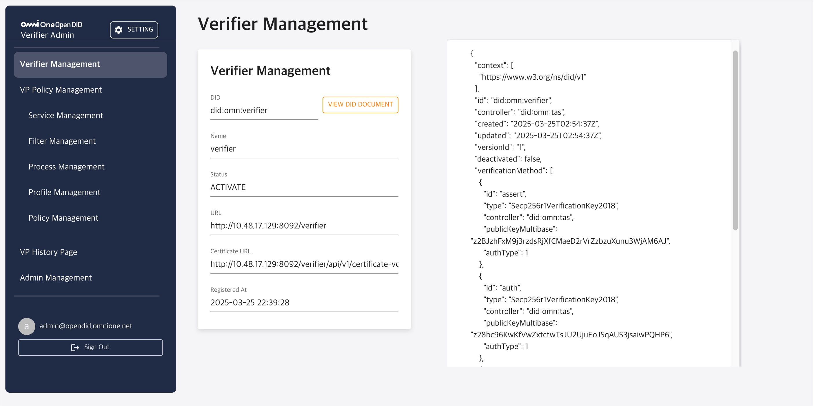

#### **정보 조회 화면 구성**

| 항목 | 표시 내용 | 설명 |
|------|-----------|------|
| **DID** | `did:omn:verifier:<식별자>` | Verifier의 고유 분산 신원 식별자 |
| **Name** | 등록 시 입력한 이름 | VP 검증 시 사용자에게 표시되는 Verifier 이름 |
| **Status** | `ACTIVATE` / `DEACTIVATE` | Verifier의 현재 활성화 상태 |
| **URL** | Verifier 서비스 기본 URL | 검증 요청 처리를 위한 접근점 |
| **Certificate URL** | 가입증명서 조회 URL | Certificate VC에 접근할 수 있는 링크 |
| **Registered At** | 등록 완료 일시 | Verifier가 시스템에 등록된 날짜와 시간 |

#### **DID Document 상세 조회**

**VIEW DID DOCUMENT** 버튼을 클릭하면 블록체인에 등록된 완전한 DID Document를 조회할 수 있습니다.

**조회 가능한 정보:**
- **@context**: DID Document의 JSON-LD 컨텍스트
- **id**: Verifier DID 식별자
- **controller**: DID를 제어하는 주체 정보
- **created**: DID Document 생성 일시
- **updated**: 마지막 업데이트 일시
- **verificationMethod**: 서명 검증에 사용할 공개키 정보
- **service**: Verifier 서비스 엔드포인트 정보

> **참고**: DID Document는 블록체인에 영구 기록되어 위변조가 불가능하며, OpenDID 생태계의 모든 참여자가 검증할 수 있습니다.

---

### 3.1.3. 문제 해결 가이드

#### **연결 테스트 실패 시**
- Verifier 서버가 정상 구동 중인지 확인
- 방화벽 설정으로 포트가 차단되지 않았는지 점검
- URL 형식이 정확한지 확인 (`http://IP:PORT/verifier`)

#### **DID 등록 승인 지연 시**
- TA 관리자에게 승인 요청 상태 문의
- CHECK 버튼을 주기적으로 클릭하여 상태 확인
- 승인 거부 시 사유를 확인하고 문제점 해결 후 재시도

#### **Entity 등록 실패 시**
- 네트워크 연결 상태 점검
- TA 서버 상태 확인
- Verifier 서버 로그에서 오류 메시지 확인

> **중요**: Verifier 등록 과정에서 문제가 발생하면 처음부터 다시 진행해야 할 수 있습니다. 각 단계를 신중하게 수행하시기 바랍니다.

## 3.2. Service Configuration

Service Configuration은 VP 및 ZKP 검증 정책에서 사용할 서비스 정보를 정의하고 관리하는 기능입니다. 

서비스는 **검증 요청의 목적과 방식을 정의하는 핵심 구성 요소**로서, 사용자에게 어떤 유형의 검증이 요구되는지 알려주고, 검증 완료 후 결과를 처리할 엔드포인트를 제공합니다. 모든 VP 및 ZKP 정책은 반드시 하나의 서비스와 연결되어야 하므로, 정책 설정 전에 우선적으로 구성해야 합니다.

### 3.2.1. Service Configuration 개요

Service Configuration 메뉴에서는 서비스의 전체 생명주기를 관리할 수 있습니다.

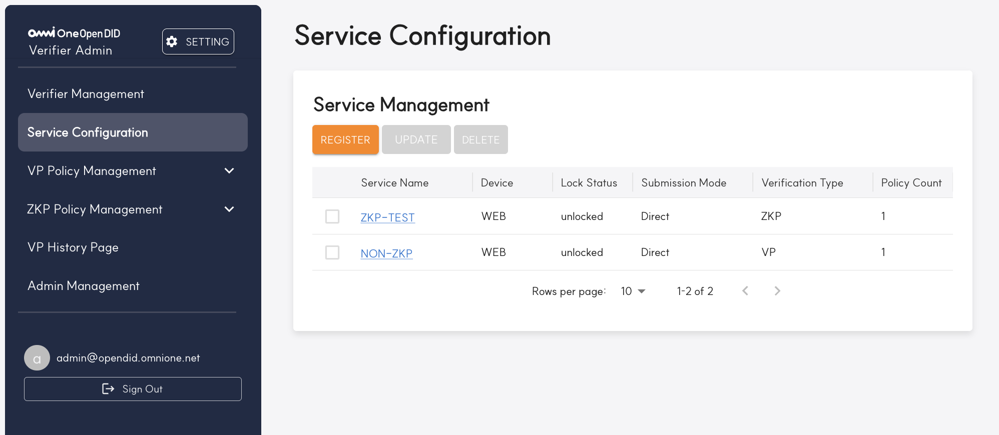

#### **화면 구성 요소**

| 번호 | 구성 요소 | 기능 설명 | 권한 |
|------|-----------|-----------|------|
| 1 | **REGISTER 버튼** | 새로운 서비스를 등록하는 페이지로 이동합니다. | 모든 관리자 |
| 2 | **UPDATE 버튼** | 선택한 서비스의 정보를 수정합니다. | 모든 관리자 |
| 3 | **DELETE 버튼** | 선택한 서비스를 삭제합니다. | 모든 관리자 |
| 4 | **서비스 목록** | 등록된 모든 서비스의 요약 정보를 표시합니다. | 조회 전용 |
| 5 | **페이지네이션** | 대량의 서비스 목록을 페이지 단위로 탐색합니다. | 조회 전용 |

#### **서비스 목록 정보**

| 컬럼 | 표시 내용 | 설명 |
|------|-----------|------|
| **Service Name** | 서비스 고유 이름 | 클릭 시 상세 페이지로 이동하는 링크 |
| **Device** | 지원 디바이스 유형 | PC, Mobile, Tablet 등 |
| **Lock Status** | 서비스 잠금 상태 | `locked` / `unlocked` (현재는 `unlocked`만 지원) |
| **Submission Mode** | VP 제출 방식 | `Direct` / `Indirect` / `Proxy` |
| **Verification Type** | 검증 유형 | `VP` (일반 검증) / `ZKP` (영지식 증명) |
| **Policy Count** | 연결된 정책 수 | 이 서비스를 사용하는 정책의 개수 |

> **중요**: Policy Count가 1 이상인 서비스는 삭제할 수 없습니다. 삭제하려면 먼저 연결된 모든 정책을 제거해야 합니다.

---

### 3.2.2. 서비스 등록 / 수정

새로운 서비스를 등록하기 위해 **REGISTER** 버튼을 클릭하면 서비스 등록 페이지로 이동합니다.
</br>
서비스 수정 **UPDATE**시에도 동일한 화면으로 구성됩니다.


#### **필수 입력 항목**

| 항목 | 설명 | 입력 예시 | 제약 조건 |
|------|------|-----------|-----------|
| **Service*** | 서비스의 고유 이름 | `IDCardVerification`, `AgeProof` | 영문, 숫자, 하이픈, 언더스코어만 허용 |
| **Device*** | 지원하는 디바이스 유형 | `PC`, `Mobile`, `Tablet` | 자유 텍스트 입력 |
| **Lock Status*** | 서비스 잠금 상태 | `Unlocked` | 현재는 `Unlocked`만 선택 가능 |
| **Submission Mode*** | VP 제출 방식 선택 | `Direct`, `Indirect` | 드롭다운에서 선택 |
| **Verification Type*** | 검증 유형 선택 | `VP`, `ZKP` | 사용할 검증 방식에 따라 선택 |

> **참고**: *표시는 필수 입력 항목입니다.

#### **Submission Mode 상세 설명**

| 모드 | 설명 | 사용 시점 |
|------|------|-----------|
| **Direct** | 사용자가 VP를 Verifier에 직접 제출 | 실시간 검증이 필요한 경우 | 
| **Indirect** | 중간 서버를 통해 VP 전달 | 네트워크 제약이 있는 환경 |
| **Proxy** | 프록시 서버를 통한 간접 전달 | 복잡한 네트워크 구성 | 

#### **Verification Type 상세 설명**

| 유형 | 설명 | 적용 사례 | 개인정보 노출 |
|------|------|-----------|---------------|
| **VP** | 일반적인 VP 검증 방식 | 신분증명, 학력증명, 자격증명 | 필요한 정보만 선택적 공개 |
| **ZKP** | 영지식 증명 기반 검증 | 나이 증명, 소득 구간 증명, 거주지 증명 | 최소한의 정보만 증명 |

#### **Endpoints 관리**

서비스와 연결될 엔드포인트 URL들을 관리하는 섹션입니다.

| 기능 | 설명 | URL 형식 예시 |
|------|------|---------------|
| **ADD ENDPOINT** | 새로운 엔드포인트 URL 추가 | `https://api.example.com/verify` |
| **삭제 (🗑️)** | 등록된 엔드포인트 제거 | 각 행의 휴지통 아이콘 클릭 |


#### **등록 버튼 기능**

| 버튼 | 기능 | 동작 |
|------|------|------|
| **REGISTER** | 입력한 정보로 서비스 등록 | 유효성 검사 후 서비스 생성 및 목록 페이지로 이동 |
| **RESET** | 모든 입력 필드 초기화 | 입력한 모든 내용을 지우고 기본값으로 되돌림 |
| **CANCEL** | 등록 취소 및 이전 페이지 이동 | 입력 내용을 저장하지 않고 서비스 목록으로 돌아감 |

---
## 3.3. VP Policy Management

VP Policy Management는 일반적인 VP(Verifiable Presentation) 검증을 위한 정책을 구성하고 관리하는 기능입니다. VP 정책은 **Filter → Process → Profile → Policy** 순서로 단계적으로 구성되며, 각 단계의 설정이 다음 단계의 기반이 됩니다.

VP 검증은 사용자가 소유한 VC(Verifiable Credential)에서 필요한 정보를 선택적으로 공개하여 신원을 증명하는 방식으로, 신분증명, 학력증명, 자격증명 등에 주로 사용됩니다. 

### 3.3.1. Filter Management

Filter는 "사용자에게 어떤 VC를 요구할 것인가?"를 결정하는 핵심 구성 요소로서, VC 스키마 ID, 필수 클레임, 허용 발급자 등을 정의합니다. 모든 VP Profile은 반드시 하나 이상의 Filter와 연결되어야 하므로, VP 정책 구성의 첫 번째 단계로 설정해야 합니다.

#### **3.3.1.1 Filter Management 화면 구성**


| 번호 | 구성 요소 | 기능 설명 | 사용 시점 |
|------|-----------|-----------|-----------|
| 1 | **REGISTER 버튼** | 새로운 Filter를 등록하는 페이지로 이동 | Filter 신규 생성 시 |
| 2 | **UPDATE 버튼** | 선택한 Filter 정보를 수정 | 기존 Filter 변경 시 |
| 3 | **DELETE 버튼** | 선택한 Filter를 삭제 | 불필요한 Filter 제거 시 |
| 4 | **Filter 목록** | 등록된 모든 Filter의 요약 정보 표시 | Filter 현황 파악 |
| 5 | **검색 및 페이징** | Filter 검색 및 페이지 단위 탐색 | 대량 데이터 관리 |

---

#### **3.3.1.2. Filter 등록 / 수정**

새로운 Filter를 등록하기 위해 **REGISTER** 버튼을 클릭하면 Filter 등록 페이지로 이동합니다.
Filter 수정 **UPDATE**시에도 동일한 화면으로 구성됩니다.

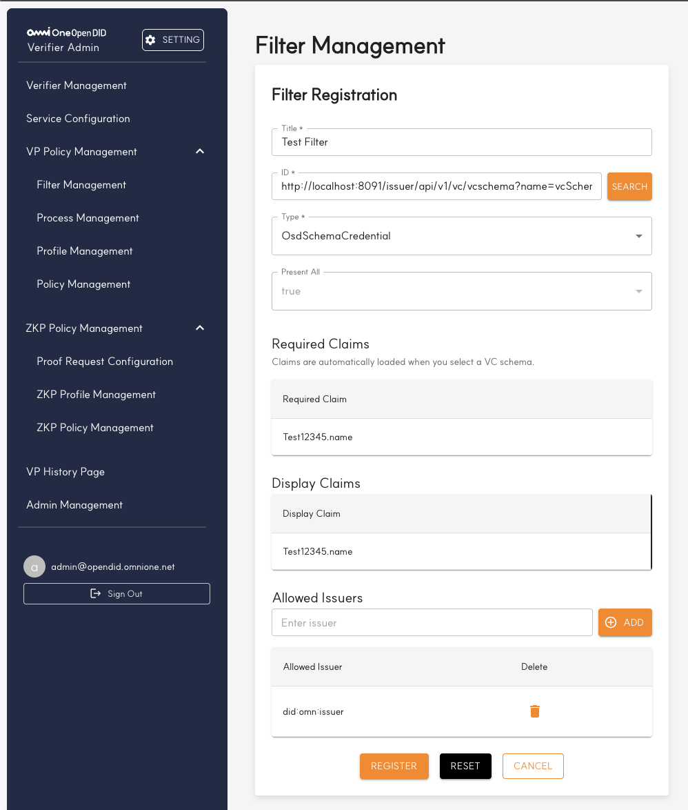

##### **기본 정보 입력**

| 항목 | 설명 | 입력 예시 | 필수 여부 |
|------|------|-----------|-----------|
| **Title*** | Filter의 고유 제목 | `국민신분증_필터`, `운전면허증_필터` | ✅ 필수 |
| **Type** | 스키마 유형 선택 | `OsdSchemaCredential` | ✅ 필수 (고정값) |
| **Present All** | 모든 클레임 제출 필요 여부 | `true` | ✅ 필수 (고정값) |

**Present All 설정 가이드:**
- **true**: 스키마의 모든 클레임을 반드시 제출해야 함 (고정값)
- **false**: Required Claims에 지정된 클레임만 제출하면 됨 (구현시 선택가능)

##### **VC 스키마 검색 및 선택**

Filter는 특정 VC 스키마를 기반으로 동작하므로, 먼저 검증에 사용할 스키마를 선택해야 합니다.

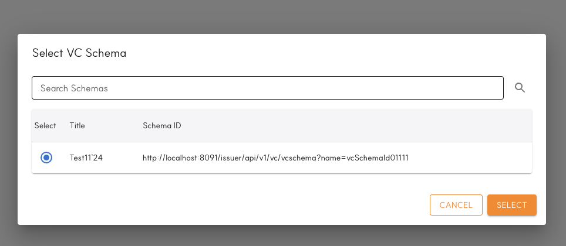

| 기능 | 설명 | 사용 방법 |
|------|------|-----------|
| **SEARCH 버튼** | List 사업자에서 스키마 목록을 조회하여 선택 | 클릭 시 스키마 선택 다이얼로그 표시 |

**스키마 선택 다이얼로그에서 확인 가능한 정보:**
- **스키마 Title**: 사람이 읽을 수 있는 스키마 명칭
- **스키마 ID**: List 사업자에서 제공하는 스키마 고유 식별자

##### **Required Claims 관리**

검증 시 반드시 제출해야 하는 클레임을 정의합니다.

| 기능 | 설명 | 동작 방식 |
|------|------|-----------|
| **클레임 목록** | 현재 설정된 필수 클레임들 | 각 클레임의 이름과 데이터 타입 표시 |

**클레임 선택 과정:**
1. **SEARCH** 버튼 클릭
2. **스키마 선택 다이얼로그** 표시
3. **스키마 체크** 선택 및및 확인
4. **선택된 스키마 기반 클레임이 자동 추가**

##### **Display Claims 관리**

사용자에게 표시할 클레임 정보를 설정합니다. Display Claims는 Required Claims와 별도로 관리되며, 검증 과정에서 사용자에게 어떤 정보가 요구되는지 명확히 알려주는 역할을 합니다.(구현목적상 Requierd Claim과 값이 동일합니다.)

##### **Allowed Issuers 관리**

이 Filter를 통해 제출되는 VC의 발급자를 제한할 수 있습니다.


| 기능 | 설명 | 입력 형식 |
|------|------|-----------|
| **ADD 버튼** | 새로운 허용 발급자 DID 추가 | DID 형식: `did:omn:issuer:xxx` |
| **발급자 DID 목록** | 현재 허용된 발급자들의 DID 목록 | 각 DID별 검증 권한 표시 |
| **삭제 (🗑️)** | 특정 발급자를 허용 목록에서 제거 | 해당 DID 행의 휴지통 아이콘 클릭 |

##### **등록 완료**

모든 정보 입력이 완료되면 다음 버튼들을 사용하여 등록을 마무리합니다.

| 버튼 | 기능 | 동작 결과 |
|------|------|-----------|
| **REGISTER** | 입력한 정보로 Filter 등록 | 유효성 검사 후 Filter 생성 및 목록 페이지로 이동 |
| **UPDATE** | 선택한 Filter 정보를 수정 | 기존 Filter 변경 시 |
| **RESET** | 모든 입력 필드 초기화 | 입력한 모든 내용을 지우고 기본값으로 되돌림 |
| **CANCEL** | 등록 취소 및 이전 페이지 이동 | 입력 내용을 저장하지 않고 Filter 목록으로 돌아감 |


---

### 3.3.2. Process Management

Process Management는 VP 제출 과정에서 사용할 **암호화 방식과 인증 절차를 정의**하는 기능입니다.

Process는 "VP 제출 과정을 어떻게 보안할 것인가?"를 결정하는 핵심 구성 요소로서, 사용자 인증 방식(PIN/생체인증), 데이터 암호화 설정, 그리고 검증 완료 후 결과를 처리할 엔드포인트를 정의합니다. Filter가 "무엇을" 검증할지 정의한다면, Process는 "어떻게" 안전하게 검증할지를 정의합니다.

#### **3.3.2.1. Process Management 화면 구성**


| 번호 | 구성 요소 | 기능 설명 | 사용 시점 |
|------|-----------|-----------|-----------|
| 1 | **REGISTER 버튼** | 새로운 Process를 등록하는 페이지로 이동 | Process 신규 생성 시 |
| 2 | **UPDATE 버튼** | 선택한 Process 정보를 수정 | 기존 Process 변경 시 |
| 3 | **DELETE 버튼** | 선택한 Process를 삭제 | 불필요한 Process 제거 시 |
| 4 | **Process 목록** | 등록된 모든 Process의 요약 정보 표시 | Process 현황 파악 |
| 5 | **검색 및 페이징** | Process 검색 및 페이지 단위 탐색 | 대량 데이터 관리 |

#### **Process 목록 정보**

| 컬럼 | 표시 내용 | 설명 |
|------|-----------|------|
| **Title** | Process의 고유 제목 | 관리자가 식별할 수 있는 명칭 |
| **Auth Type** | 사용자 인증 방식 | `PIN` (핀 번호) / `BIO` (생체 인증) |
| **Curve** | 타원곡선 암호화 알고리즘 | `Secp256r1` 등 암호화 표준 |
| **Cipher** | 대칭키 암호화 알고리즘 | `AES-128-CBC`, `AES-256-CBC` 등 |
| **Padding** | 패딩 방식 | `PKCS5`, `PKCS7` 등 |
| **Created At** | 생성 일시 | Process가 처음 등록된 날짜와 시간 |

> **중요**: Profile Count가 1 이상인 Process는 삭제할 수 없습니다. 삭제하려면 먼저 연결된 모든 Profile에서 해당 Process를 제거해야 합니다.

---

#### **3.3.2.2. Process 등록 / 수정**

새로운 Process를 등록하기 위해 **REGISTER** 버튼을 클릭하면 Process 등록 페이지로 이동합니다.</br>
Process 수정 **UPDATE**시에도 동일한 화면으로 구성됩니다.


##### **기본 정보 입력**

| 항목 | 설명 | 입력 예시 | 필수 여부 |
|------|------|-----------|-----------|
| **Title*** | Process의 고유 제목 | `생체인증_프로세스` | ✅ 필수 |
| **Auth Type*** | 사용자 인증 방식 선택 | `PIN or BIO` | ✅ 필수(고정값) |

##### **ReqE2e Information (End-to-End 암호화 설정)**

VP 제출 과정에서 사용할 암호화 알고리즘과 방식을 설정합니다.

| 암호화 구성 요소 | 설명 | 지원 옵션 | 필수 여부 |
|------------------|------|-----------|-----------|
| **Curve*** | 타원곡선 암호화 알고리즘 | `Secp256r1` | ✅ 필수 `Secp256r1` (고정값) |
| **Cipher*** | 대칭키 암호화 알고리즘 | `AES-256-CBC` | ✅ 필수 `AES-256-CBC` (고정값) |
| **Padding*** | 블록 암호화 패딩 방식 | `PKCS5` | ✅ 필수 `PKCS5` (고정값) |


##### **Endpoints 관리**

Process 실행 중 발생하는 이벤트를 처리할 외부 엔드포인트를 설정합니다.

| 기능 | 설명 | URL 형식 예시 |
|------|------|---------------|
| **ADD 버튼** | 새로운 엔드포인트 URL 추가 | `https://api.company.com/vp-callback` |
| **엔드포인트 목록** | 현재 등록된 모든 URL 표시 | 각 URL의 용도와 상태 확인 가능 |
| **Delete 열** | 특정 엔드포인트 제거 | 해당 행의 Delete 버튼 클릭 |


##### **등록 완료**

모든 정보 입력이 완료되면 다음 버튼들을 사용하여 등록을 마무리합니다.

| 버튼 | 기능 | 동작 결과 |
|------|------|-----------|
| **REGISTER** | 입력한 정보로 Process 등록 | 암호화 설정 검증 후 Process 생성 및 목록 페이지로 이동 |
| **UPDATE** | 선택한 Process 정보를 수정 | 기존 Process 변경 시 |
| **RESET** | 모든 입력 필드 초기화 | 입력한 모든 내용을 지우고 기본값으로 되돌림 |
| **CANCEL** | 등록 취소 및 이전 페이지 이동 | 입력 내용을 저장하지 않고 Process 목록으로 돌아감 |

---

### 3.3.3. Profile Management

Profile Management는 앞서 정의한 **Filter와 Process를 조합하여 완전한 VP 검증 프로파일을 생성**하는 기능입니다.

Profile은 "어떤 VC를 어떤 방식으로 검증할 것인가?"를 정의하는 통합 구성 요소로서, Filter(검증 대상)와 Process(검증 방식)를 결합하여 사용자에게 제공할 검증 경험을 완성합니다. Profile은 최종 Policy 생성의 직접적인 기반이 되므로, VP 정책 구성의 핵심 단계입니다.

#### **3.3.3.1. Profile Management 화면 구성**


| 번호 | 구성 요소 | 기능 설명 | 사용 시점 |
|------|-----------|-----------|-----------|
| 1 | **REGISTER 버튼** | 새로운 Profile을 등록하는 페이지로 이동 | Profile 신규 생성 시 |
| 2 | **UPDATE 버튼** | 선택한 Profile 정보를 수정 | 기존 Profile 변경 시 |
| 3 | **DELETE 버튼** | 선택한 Profile을 삭제 | 불필요한 Profile 제거 시 |
| 4 | **Profile 목록** | 등록된 모든 Profile의 요약 정보 표시 | Profile 현황 파악 |
| 5 | **검색 및 페이징** | Profile 검색 및 페이지 단위 탐색 | 대량 데이터 관리 |

#### **Profile 목록 정보**

| 컬럼 | 표시 내용 | 설명 |
|------|-----------|------|
| **Profile Title** | Profile의 고유 제목 | 관리자 식별용 명칭 |
| **Profile Description** | Profile 설명 | 용도와 특징 설명 |
| **Created At** | 등록 일시 | 처음 등록된 날짜와 시간 |

> **경고**: 이미 Policy Management에 등록된 프로파일은 삭제할 수 없습니다. 삭제하려면 먼저 연결된 Policy에서 해당 프로파일을 제거해야 합니다.

---

#### **3.3.3.2. Profile 등록 / 수정**

새로운 Profile을 등록하기 위해 **REGISTER** 버튼을 클릭하면 Profile 등록 페이지로 이동합니다.
Profile을 수정 **UPDATE**시에도 동일한 화면으로 구성됩니다.


##### **기본 정보 입력**

| 항목 | 설명 | 입력 예시 | 필수 여부 |
|------|------|-----------|-----------|
| **Title*** | Profile의 고유 제목 | `학위증명_일반_프로파일` | ✅ 필수 |
| **Type** | Profile 유형 | `VerifyProfile` | ✅ 필수 (고정값) |
| **Description*** | Profile에 대한 상세 설명 | `신분증 검증용 프로파일` | ✅ 필수 |
| **Encoding*** | 문자 인코딩 방식 | `UTF-8` | ✅ 필수 |
| **Language*** | 지원 언어 | `ko` (한국어), `en` (영어) | ✅ 필수 |

##### **Verifier Information (자동 설정)**

Verifier 정보는 가입증명서를 통해 자동으로 입력되며 수정할 수 없습니다.

| 정보 항목 | 자동 설정 내용 | 출처 |
|-----------|----------------|------|
| **Verifier DID** | `did:omn:verifier:<식별자>` | Verifier 등록 시 생성된 DID |
| **Verifier Name** | 등록된 Verifier 이름 | Verifier Management에서 설정한 이름 |
| **Certificate URL** | 가입증명서 접근 URL | TA로부터 발급받은 Certificate VC 위치 |

> **참고**: 이 정보는 VP 검증 시 사용자에게 "누가 검증을 요청하는가?"를 알려주는 중요한 신뢰 정보입니다.

##### **Process Information 선택**

Profile에 연결할 Process를 선택합니다.


| 기능 | 설명 | 선택 기준 |
|------|------|-----------|
| **Process 선택 필드** | 현재 선택된 Process 이름 표시 | 읽기 전용 필드 |
| **Search 버튼** | Process 검색 다이얼로그 열기 | 등록된 모든 Process 중 선택 |

##### **Filter Information 선택**

Profile에 연결할 Filter를 선택합니다.

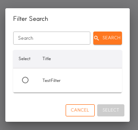

| 기능 | 설명 | 선택 기준 |
|------|------|-----------|
| **Filter 선택 필드** | 현재 선택된 Filter 이름 표시 | 읽기 전용 필드 |
| **Search 버튼** | Filter 검색 다이얼로그 열기 | 등록된 모든 Filter 중 선택 |

##### **등록 완료**

모든 정보 입력이 완료되면 다음 버튼들을 사용하여 등록을 마무리합니다.

| 버튼 | 기능 | 동작 결과 |
|------|------|-----------|
| **REGISTER** | 입력한 정보로 Profile 등록 | Filter/Process 조합 검증 후 Profile 생성 및 목록 페이지로 이동 |
| **RESET** | 모든 입력 필드 초기화 | 입력한 모든 내용을 지우고 기본값으로 되돌림 (선택한 Filter/Process 포함) |
| **CANCEL** | 등록 취소 및 이전 페이지 이동 | 입력 내용을 저장하지 않고 Profile 목록으로 돌아감 |

### 3.3.4. Policy Management

Policy Management는 앞서 구성한 **Service와 Profile을 연결하여 완전한 VP 검증 정책을 생성**하는 기능입니다.

Policy는 VP 정책 구성의 최종 단계로서, "어떤 서비스에서 어떤 방식으로 검증할 것인가?"를 정의하는 실행 가능한 검증 규칙입니다. Service(검증 목적과 결과 처리)와 Profile(검증 대상과 방식)을 결합하여 실제 사용자가 경험할 전체 검증 워크플로우를 완성합니다. 생성된 Policy는 외부 시스템에서 VP 검증 요청 시 직접 참조되는 핵심 구성 요소입니다.

#### **3.3.4.1. Policy Management 화면 구성**


| 번호 | 구성 요소 | 기능 설명 | 사용 시점 |
|------|-----------|-----------|-----------|
| 1 | **REGISTER 버튼** | 새로운 Policy를 등록하는 페이지로 이동 | Policy 신규 생성 시 |
| 2 | **UPDATE 버튼** | 선택한 Policy 정보를 수정 | 기존 Policy 변경 시 |
| 3 | **DELETE 버튼** | 선택한 Policy를 삭제 | 불필요한 Policy 제거 시 |
| 4 | **Policy 목록** | 등록된 모든 Policy의 요약 정보 표시 | Policy 현황 파악 |
| 5 | **검색 및 페이징** | Policy 검색 및 페이지 단위 탐색 | 대량 데이터 관리 |

#### **Policy 목록 정보**

| 컬럼 | 표시 내용 | 설명 |
|------|-----------|------|
| **Profile Title** | ZKP Profile의 고유 제목 | 관리자 식별용 명칭 |
| **Profile Description** | Profile 설명 | 용도와 특징 설명 |
| **Proof Request** | 연결된 Proof Request 이름 | 사용하는 증명 요구사항 |
| **Used in Policies** | 연결된 Policy 수 | 이 Profile을 사용하는 ZKP Policy 개수 |
| **Registered At** | 등록 일시 | 처음 등록된 날짜와 시간 |

> **경고**: 이미 ZKP Policy Management에 등록된 프로파일은 삭제할 수 없습니다. 삭제하려면 먼저 연결된 Policy에서 해당 프로파일을 제거해야 합니다.

---

#### **3.3.4.2. Policy 등록**

새로운 Policy를 등록하기 위해 **REGISTER** 버튼을 클릭하면 Policy 등록 페이지로 이동합니다.

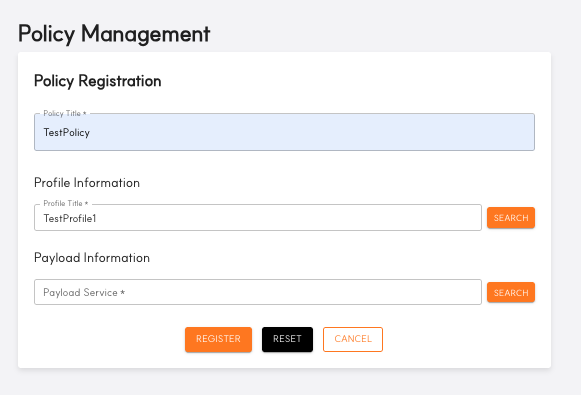

##### **기본 정보 입력**

| 항목 | 설명 | 입력 예시 | 필수 여부 |
|------|------|-----------|-----------|
| **Policy Title*** | Policy의 고유 제목 | `신분증_검증_정책`, `직원_출입_정책` | ✅ 필수 |

##### **Profile Information 선택**

Policy에 연결할 Profile을 선택합니다.

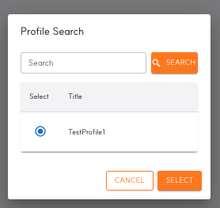

| 기능 | 설명 | 선택 기준 |
|------|------|-----------|
| **Profile 선택 필드** | 현재 선택된 Profile 이름 표시 | 읽기 전용 필드 |
| **SEARCH 버튼** | Profile 검색 다이얼로그 열기 | 등록된 모든 Profile 중 선택 |

**Profile 선택 다이얼로그에서 확인 가능한 정보:**
- **Profile Title**: 프로파일의 이름과 용도

##### **Payload Information 선택**

Policy에 연결할 Service를 선택합니다.


| 기능 | 설명 | 선택 기준 |
|------|------|-----------|
| **Payload 선택 필드** | 현재 선택된 Service 이름 표시 | 읽기 전용 필드 |
| **SEARCH 버튼** | Service 검색 다이얼로그 열기 | 등록된 모든 Service 중 선택 |

**서비스(Payload) 선택 다이얼로그에서 확인 가능한 정보:**
- **Title**: 서비스의 이름과 용도

##### **등록 완료**

모든 정보 입력이 완료되면 다음 버튼들을 사용하여 등록을 마무리합니다.

| 버튼 | 기능 | 동작 결과 |
|------|------|-----------|
| **REGISTER** | 입력한 정보로 Policy 등록 | Service/Profile 호환성 검증 후 Policy 생성 및 목록 페이지로 이동 |
| **RESET** | 모든 입력 필드 초기화 | 입력한 모든 내용을 지우고 기본값으로 되돌림 |
| **CANCEL** | 등록 취소 및 이전 페이지 이동 | 입력 내용을 저장하지 않고 Policy 목록으로 돌아감 |

---
<br/>

## 3.4. ZKP Policy Management

ZKP Policy Management는 ZKP(Zero-Knowledge Proof) 정책을 관리하기 위한 메뉴입니다. 여러 하위 메뉴로 구성되어 있으며, 각 메뉴는 ZKP 정책의 특정 측면을 관리합니다.

### 3.4.1. Proof Request Configuration

Proof Request Configuration 메뉴에서는 ZKP 검증 시 사용할 증명 요청 정보를 등록, 수정, 삭제할 수 있습니다.


Proof Request Configuration 화면은 다음과 같은 주요 기능을 제공합니다:
- REGISTER: 새로운 증명 요청을 등록합니다.
- UPDATE: 선택한 증명 요청을 수정합니다(항목을 선택해야 활성화).
- DELETE: 선택한 증명 요청을 삭제합니다(항목을 선택해야 활성화).

증명 요청 목록 테이블에는 Name, Version, Profile Count, Registered At, Updated At 등의 정보가 표시되며, 페이지네이션 기능을 통해 여러 페이지의 데이터를 탐색할 수 있습니다.

#### 3.4.1.1 Proof Request Register

증명 요청 등록 페이지에서는 새로운 증명 요청을 등록하기 위한 정보를 입력할 수 있습니다. 이 페이지는 증명 요청 수정 시에도 동일한 양식으로 사용됩니다.

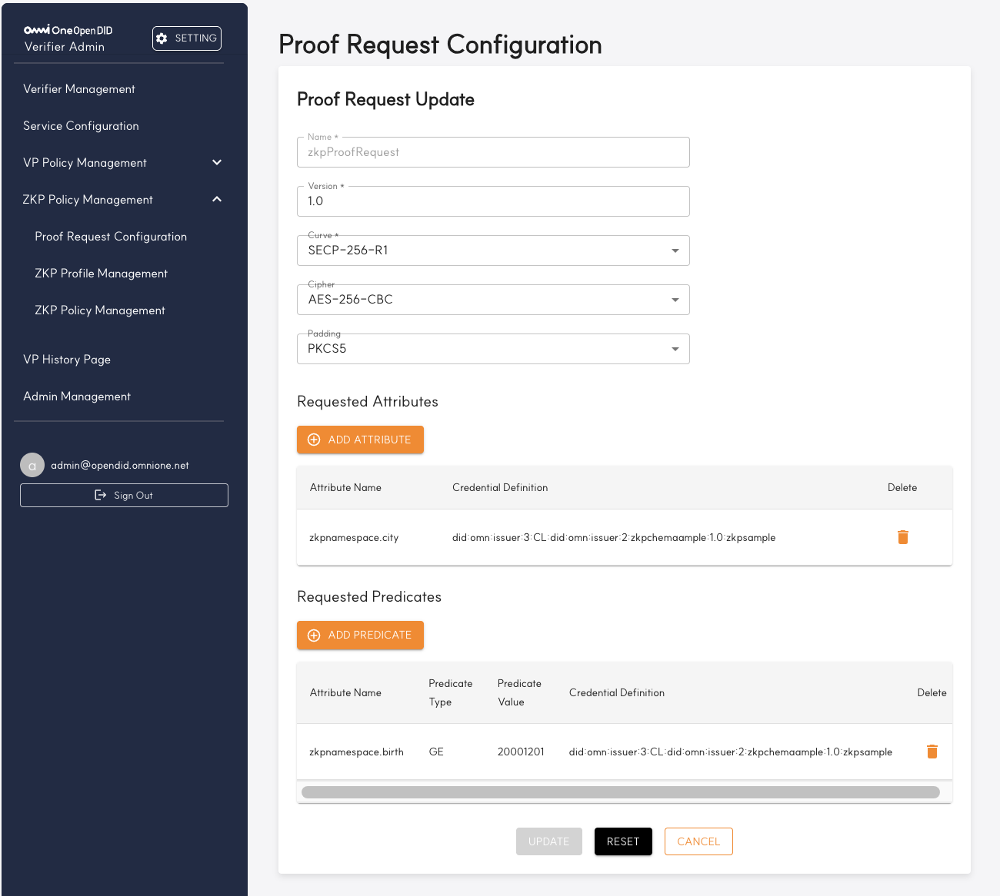

| 번호 | 항목 | 설명 |
|------|------|------|
| 1 | Name | 증명 요청의 이름을 입력하는 필드입니다. 예시로 "zkpProofRequest"가 입력되어 있습니다. |
| 2 | Version | 증명 요청의 버전을 입력합니다. 예시로 "1.0"이 입력되어 있습니다. |
| 3 | Curve | 사용할 타원 곡선 알고리즘을 선택합니다. 드롭다운 메뉴에서 "SECP-256-R1" 등의 옵션을 선택할 수 있습니다. |
| 4 | Cipher | 암호화 알고리즘을 선택합니다. 드롭다운 메뉴에서 "AES-256-CBC" 등의 옵션을 선택할 수 있습니다. |
| 5 | Padding | 패딩 방식을 선택합니다. 드롭다운 메뉴에서 "PKCS5" 등의 옵션을 선택할 수 있습니다. |
| 6 | Requested Attributes | 요청할 속성을 관리하는 섹션입니다. "ADD ATTRIBUTE" 버튼을 클릭하여 팝업에서 스키마를 선택하여 속성을 추가할 수 있습니다. 각 속성은 Attribute Name과 Credential Definition으로 구성됩니다. 입력된 속성을 삭제하려면 해당 항목 오른쪽의 휴지통 아이콘을 클릭하세요. |
| 7 | Requested Predicates | 요청할 조건부를 관리하는 섹션입니다. "ADD ATTRIBUTE" 버튼을 클릭하여 팝업에서 스키마를 선택하여 속성을 추가할 수 있습니다. 각 조건부는 Attribute Name, Predicate Type, Predicate Value, Credential Definition으로 구성됩니다. 입력된 조건부를 삭제하려면 해당 항목 오른쪽의 휴지통 아이콘을 클릭하세요. |
| 8 | 버튼 영역 | - UPDATE: 입력한 정보로 증명 요청을 수정합니다.<br>- RESET: 모든 입력 필드를 초기화합니다. 수정 모드에서는 기존 입력값으로 되돌립니다.<br>- CANCEL: 입력을 취소하고 이전 페이지(증명 요청 목록)로 돌아갑니다. |

 > **참고**: ZKP 검증에 사용되는 데이터 정보의 자세한 내용은 데이터 스펙 Data Specification 문서를 참고바랍니다.

### 3.4.2. ZKP Profile Management

ZKP Profile Management 메뉴에서는 ZKP 프로파일 정보를 관리할 수 있습니다. 이 화면에서는 프로파일 목록을 확인하고, 등록, 수정, 삭제 작업을 수행할 수 있습니다.

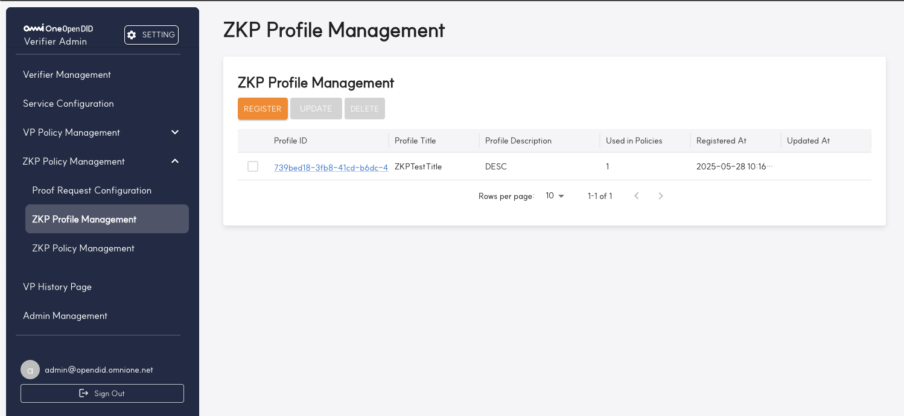

ZKP Profile Management 화면은 다음과 같은 주요 기능을 제공합니다:
- REGISTER: 새로운 ZKP 프로파일을 등록합니다.
- UPDATE: 선택한 ZKP 프로파일을 수정합니다(항목을 선택해야 활성화).
- DELETE: 선택한 ZKP 프로파일을 삭제합니다(항목을 선택해야 활성화).

ZKP 프로파일 목록 테이블에는 Profile ID, Profile Title, Profile Description, Used in Policies, Registered At, Updated At 등의 정보가 표시되며, 페이지네이션 기능을 통해 여러 페이지의 데이터를 탐색할 수 있습니다.

> **경고**: 이미 ZKP Policy Management에 등록된 프로파일은 삭제할 수 없습니다. 삭제하려면 먼저 연결된 Policy에서 해당 프로파일을 제거해야 합니다.

#### 3.4.2.1 ZKP Profile Register

ZKP 프로파일 등록 페이지에서는 새로운 ZKP 프로파일을 등록하기 위한 정보를 입력할 수 있습니다. 이 페이지는 프로파일 수정 시에도 동일한 양식으로 사용됩니다.

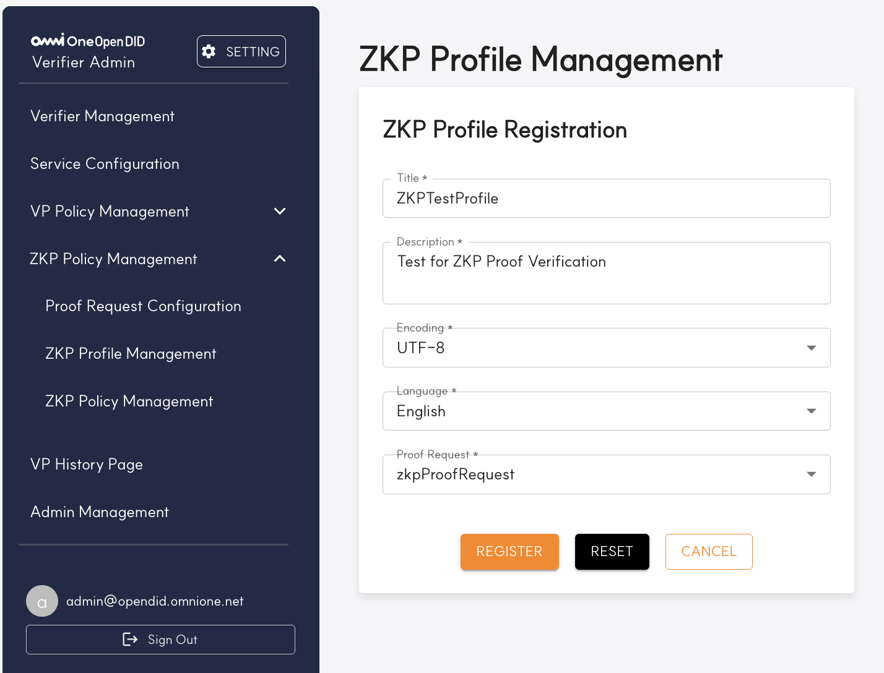

| 번호 | 항목 | 설명 |
|------|------|------|
| 1 | Title | ZKP 프로파일의 제목을 입력하는 필드입니다. 예시로 "ZKPTestProfile"이 입력되어 있습니다. |
| 2 | Description | ZKP 프로파일에 대한 설명을 입력하는 필드입니다. 예시로 "Test for ZKP Proof Verification"이 입력되어 있습니다. |
| 3 | Encoding | 프로파일에서 사용하는 인코딩 방식을 선택합니다. 드롭다운 메뉴에서 "UTF-8" 등의 옵션을 선택할 수 있습니다. |
| 4 | Language | 프로파일 언어를 선택합니다. 드롭다운 메뉴에서 "English" 등의 옵션을 선택할 수 있습니다. |
| 5 | Proof Request | 프로파일에 연결할 Proof Request를 선택합니다. 드롭다운 메뉴에서 "zkpProofRequest" 등 등록된 증명 요청을 선택할 수 있습니다. |
| 6 | 버튼 영역 | - REGISTER: 입력한 정보로 ZKP 프로파일을 등록합니다.<br>- RESET: 모든 입력 필드를 초기화합니다. 수정 모드에서는 기존 입력값으로 되돌립니다.<br>- CANCEL: 입력을 취소하고 이전 페이지(ZKP 프로파일 목록)로 돌아갑니다. |

### 3.4.3. ZKP Policy Management

ZKP Policy Management 메뉴에서는 전체 ZKP 정책을 통합 관리할 수 있습니다. 이 화면에서는 정책 목록을 확인하고, 등록, 수정, 삭제 작업을 수행할 수 있습니다.


ZKP Policy Management 화면은 다음과 같은 주요 기능을 제공합니다:
- REGISTER: 새로운 ZKP 정책을 등록합니다.
- UPDATE: 선택한 ZKP 정책을 수정합니다(항목을 선택해야 활성화).
- DELETE: 선택한 ZKP 정책을 삭제합니다(항목을 선택해야 활성화).

ZKP 정책 목록 테이블에는 Policy Title, Payload Service, Profile Title, Created At 등의 정보가 표시되며, 페이지네이션 기능을 통해 여러 페이지의 데이터를 탐색할 수 있습니다.

ZKP 정책은 ZKP 검증을 위한 중요한 요소로, ZKP Profile과 Service를 연결하여 전체 ZKP 검증 프로세스를 정의합니다.

#### 3.4.3.1 ZKP Policy Register

ZKP 정책 등록 페이지에서는 새로운 ZKP 정책을 등록하기 위한 정보를 입력할 수 있습니다. 이 페이지는 정책 수정 시에도 동일한 양식으로 사용됩니다.

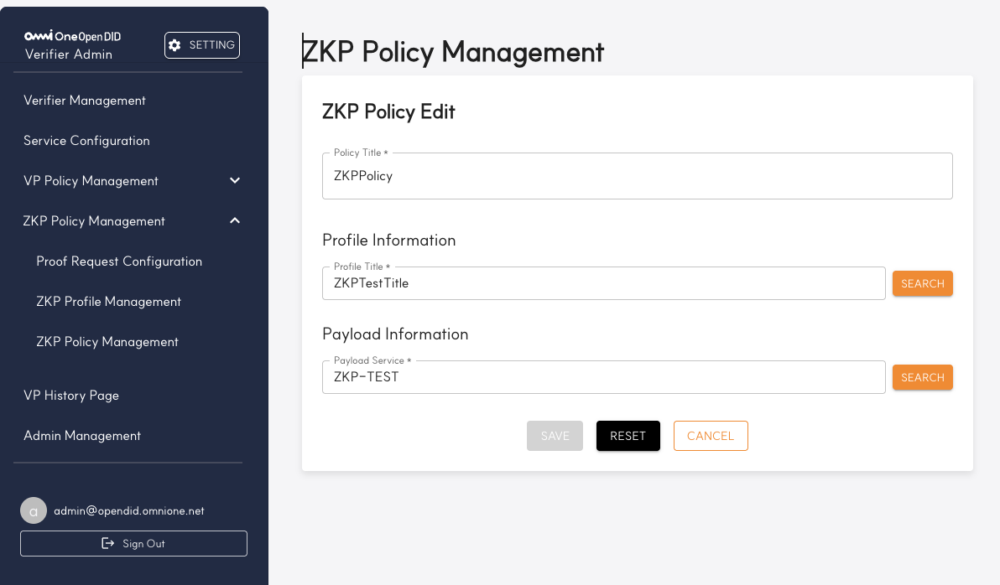

ZKP 정책 등록 화면은 다음과 같은 항목으로 구성됩니다:

| 번호 | 항목 | 설명 |
|------|------|------|
| 1 | Policy Title | ZKP 정책의 제목을 입력하는 필드입니다. 예시로 "ZKPPolicy"가 입력되어 있습니다. |
| 2 | Profile Information | 정책에 연결할 ZKP 프로파일 정보를 선택합니다. "SEARCH" 버튼을 클릭하면 ZKP 프로파일 검색 팝업이 표시되며, 검색 후 선택한 프로파일이 이 필드에 자동으로 입력됩니다. |
| 3 | Payload Information | 정책에 사용할 서비스 정보를 선택합니다. "SEARCH" 버튼을 클릭하면 서비스 검색 팝업이 표시되며, 검색 후 선택한 서비스가 이 필드에 자동으로 입력됩니다. |
| 4 | 버튼 영역 | - SAVE: 입력한 정보로 ZKP 정책을 저장합니다.<br>- RESET: 모든 입력 필드를 초기화합니다. 수정 모드에서는 기존 입력값으로 되돌립니다.<br>- CANCEL: 입력을 취소하고 이전 페이지(ZKP 정책 목록)로 돌아갑니다. |

ZKP 정책 등록 시 필요한 주요 구성 요소는 다음과 같습니다:
- Policy Title: ZKP 정책의 고유 이름
- Profile: ZKP 검증을 위한 프로파일 정보
- Payload Service: ZKP 요청 시 사용될 서비스 정보

<br/>

### 3.5. VP History Page

VP History Page 메뉴에서는 사용자들이 제출한 VP(Verifiable Presentation)에 대한 이력을 조회할 수 있습니다. 이 화면에서는 각 VP 제출 시도의 상태와 세부 정보를 확인할 수 있으며, 성공한 제출뿐만 아니라 실패하거나 진행 중인 요청도 모두 추적할 수 있습니다.

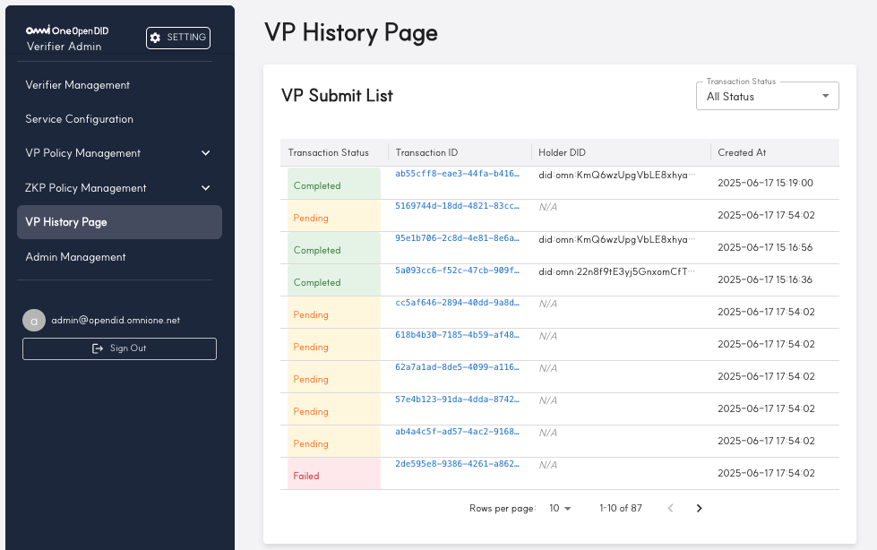

VP History Page는 다음과 같은 주요 기능과 정보를 제공합니다:

| 번호 | 항목 | 설명 |
|------|------|------|
| 1 | VP Submit List | VP 제출 목록 제목입니다. |
| 2 | Transaction Status 필터 | 드롭다운 메뉴를 통해 특정 상태(All, Completed, Pending, Failed)의 VP 제출 건만 필터링할 수 있습니다. |
| 3 | 목록 헤더 | Transaction Status, Transaction ID, Holder DID, Created At 등 VP 제출 정보의 헤더입니다. |
| 4 | 상태 표시 | VP 제출 건의 상태를 색상으로 구분합니다. 완료된 건은 녹색 배경의 'Completed', 처리 중인 건은 노란색 배경의 'Pending', 실패한 건은 빨간색 배경의 'Failed'로 표시됩니다. |
| 5 | Transaction ID | 각 VP 제출 시도의 고유 트랜잭션 식별자가 표시됩니다. 이를 통해 모든 상태의 요청을 추적할 수 있습니다. |
| 6 | DID 정보 | 각 VP 제출 건의 Holder DID(VP를 제출한 사용자의 DID)와 제출 시간(Created At)이 표시됩니다. ZKP의 경우 해당값은 "ZKP holder DID"의 임의값으로 입력됩니다. Pending이나 Failed 상태의 경우 "N/A"로 표시됩니다. |
| 7 | 페이지네이션 | 한 페이지에 표시할 행 수를 선택하고, 페이지 간 이동을 할 수 있습니다. 예시에서는 총 87건 중 1-10건이 표시되고 있습니다. |

VP 이력을 통해 관리자는 다음과 같은 작업을 수행할 수 있습니다:
- 특정 상태(Completed, Pending, Failed)의 VP 제출 현황 파악
- 특정 사용자(Holder DID)의 VP 제출 이력 조회
- 실패한 요청의 Transaction ID를 통한 문제 추적 및 디버깅


## 3.6. Admin Management

`Admin Management` 메뉴는 Verifier Admin Console에 접근할 수 있는 관리자 계정을 관리하는 기능입니다.  

Verifier 서버를 설치하면 기본적으로 `admin@opendid.omnione.net` 계정이 ROOT 권한으로 자동 생성됩니다.  
이 계정은 시스템 내 유일한 ROOT 계정이며, 삭제할 수 없습니다.

관리자 계정은 **ROOT**와 **Normal Admin** 두 가지 권한 유형으로 구분됩니다.  
ROOT 계정은 `Admin Management` 메뉴에서 모든 기능을 수행할 수 있으며, Normal Admin은 일반적인 조회 기능만 가능합니다.

---
> **참고:** 현재는 ROOT 계정과 Normal Admin 계정 간의 권한 차이는  
> `Admin Management` 메뉴에서 표시되는 버튼의 차이(Root만 REGISTER / DELETE / CHANGE PASSWORD 가능) 외에는 없습니다.  
> 그 외 시스템의 다른 메뉴에 대한 접근 권한이나 기능 제한은 아직 적용되어 있지 않습니다.
---


<br/>

## 3.6.1 Admin 목록 조회


`Admin Management` 메뉴에 진입하면 등록된 관리자 계정들의 목록이 테이블 형태로 표시됩니다.


| 번호 | 항목                    | 설명                                                             |
| ---- | ----------------------- | ---------------------------------------------------------------- |
| 1    | **REGISTER 버튼**       | 새로운 관리자 계정을 등록할 수 있는 등록 페이지로 이동합니다.       |
| 2    | **DELETE 버튼**         | 선택한 관리자 계정을 삭제합니다. (ROOT 관리자만 가능)              |
| 3    | **CHANGE PASSWORD 버튼** | 선택한 관리자 계정의 비밀번호를 변경할 수 있습니다.                |
| 4    | **ID**                  | 등록된 관리자 계정의 이메일 ID입니다.                              |
| 5    | **Role**                | 해당 관리자 계정의 역할(Role)입니다. (예: ROOT, Normal Admin 등)   |
| 6    | **Registered At**       | 해당 계정이 최초 등록된 일시입니다.                               |
| 7    | **Updated At**          | 마지막으로 수정된 일시입니다.     

<br/>

## 3.6.2. Admin 등록

`Admin Management` 화면에서 **REGISTER** 버튼을 클릭하면, 아래와 같은 등록 화면으로 이동합니다.

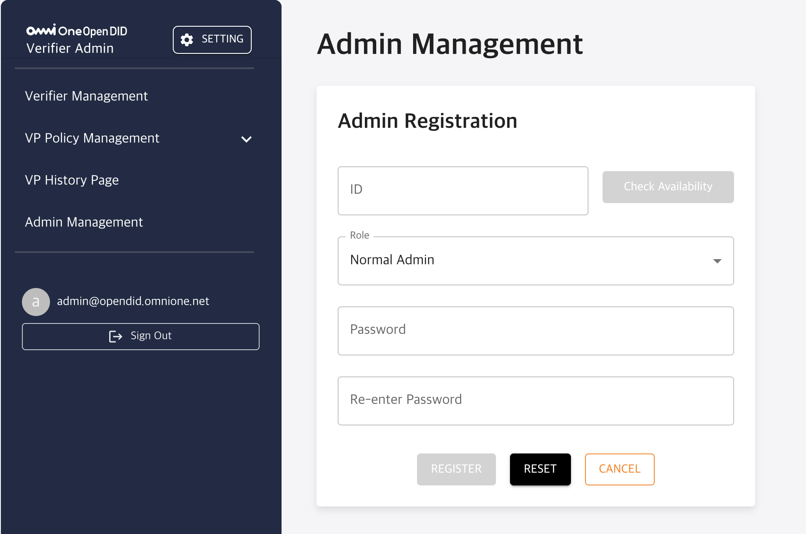

| 번호 | 항목                        | 설명                                                                |
| ---- | --------------------------- | ------------------------------------------------------------------- |
| 1    | **ID**                      | 등록할 관리자 계정의 ID입니다. 이메일 형식을 사용해야 합니다.         |
| 2    | **Check Availability 버튼** | 입력한 ID가 중복되지 않는지 확인합니다.                             |
| 3    | **Role**                    | 등록할 관리자 계정의 권한을 선택합니다. (예: Normal Admin)           |
| 4    | **Password**                | 로그인 시 사용할 비밀번호를 입력합니다.                              |
| 5    | **Re-enter Password**       | 비밀번호를 한 번 더 입력하여 일치 여부를 확인합니다.                |
| 6    | **REGISTER 버튼**           | 입력한 정보를 바탕으로 관리자 계정을 등록합니다.                    |
| 7    | **RESET 버튼**              | 모든 입력값을 초기화합니다.                                         |
| 8    | **CANCEL 버튼**             | 등록을 취소하고 이전 화면으로 돌아갑니다.                           |


[Open DID Installation Guide]: https://github.com/OmniOneID/did-release/blob/main/release-V2.0.0.0/OpenDID_Installation_Guide-V2.0.0.0_ko.md
