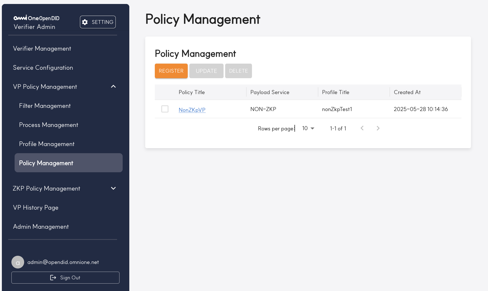

---
puppeteer:
    pdf:
        format: A4
        displayHeaderFooter: true
        landscape: false
        scale: 0.8
        margin:
            top: 1.2cm
            right: 1cm
            bottom: 1cm
            left: 1cm
    image:
        quality: 100
        fullPage: false
---

Open DID Verifier Admin Console Guide
==

- Date: 2025-03-31
- Version: v1.0.0

목차
==

- [1. 소개](#1-소개)
  - [1.1. 개요](#11-개요)
  - [1.2. Admin Console 정의](#12-admin-console-정의)
- [2. 기본 메뉴얼](#2-기본-메뉴얼)
  - [2.1. 로그인](#21-로그인)
  - [2.2. 메인 화면 구성](#22-메인-화면-구성)
  - [2.3. 메뉴 구성](#23-메뉴-구성)
  - [2.4. 비밀번호 변경 관리](#24-비밀번호-변경-관리)
- [3. 기능별 상세 메뉴얼](#3-기능별-상세-메뉴얼)
  - [3.1. Verifier Management](#31-verifier-management)
    - [3.1.1 DID Document 조회](#311-did-document-조회)
  - [3.2. VP Policy Management](#32-vp-policy-management)
    - [3.2.1. Service Management](#321-service-management)
      - [3.2.1.1 Service Register](#3211-service-register)
    - [3.2.2. Filter Management](#322-filter-management)
      - [3.2.2.1 Filter Register](#3221-filter-register)
    - [3.2.3. Process Management](#323-process-management)
      - [3.2.2.1 Process Register](#3231-process-register)
    - [3.2.4. Profile Management](#324-profile-management)
    - [3.2.5. Policy Management](#325-policy-management)
  - [3.3. VP History Page](#33-vp-history-page)
  - [3.4. Admin Management](#34-admin-management)
    - [3.4.1 Admin 목록 조회](#341-admin-목록-조회)
    - [3.4.2 Admin 등록](#342-admin-등록)

# 1. 소개

## 1.1. 개요

본 문서는 Open DID Verifier Admin Console의 설치 및 구동에 관한 가이드를 제공합니다. Admin Console의 기본 메뉴얼과 기능별 상세 메뉴얼을 단계별로 설명하여, 사용자가 이를 효율적으로 사용할 수 있도록 안내합니다.

OpenDID의 전체 설치에 대한 가이드는 [Open DID Installation Guide]를 참고해 주세요.

<br/>

## 1.2. Admin Console 정의

Verifier Admin Console은 Open DID 시스템에서 Verifier 서버를 관리하기 위한 웹 기반 관리 도구입니다. 이 도구를 통해 관리자는 Verifiable Presentation(VP) 검증 정책을 설정하고, 검증 요청 및 결과를 모니터링하며, 시스템 설정을 관리할 수 있습니다.

Admin Console은 다음과 같은 주요 기능을 제공합니다:

- Verifier 기본 정보 관리
- VP 정책 생성 및 관리
- VP 검증 이력 조회
- 관리자 계정 관리

<br/>

# 2. 기본 메뉴얼

이 장에서는 Open DID Verifier Admin Console의 기본적인 사용 방법에 대해 안내합니다.

## 2.1. 로그인

Admin Console에 접속하려면 다음 단계를 따르세요:

1. 웹 브라우저를 열고 Verifier Admin Console URL에 접속합니다.

   ```
   http://<verifier_domain>:<port>
   ```

2. 로그인 화면에서 관리자 계정의 이메일과 비밀번호를 입력합니다.
   - 기본 관리자 계정: <admin@opendid.omnione.net>
   - 초기 비밀번호: password (최초 로그인 시 변경 필요)

3. '로그인' 버튼을 클릭합니다.

> **참고**: 보안상의 이유로 최초 로그인 시에는 비밀번호 변경이 필요합니다.

<br/>

## 2.2. 메인 화면 구성

로그인 후 표시되는 메인 화면은 다음과 같은 요소로 구성됩니다:


| 번호 | 영역 | 설명 |
|------|------|------|
| 1 | 설정 버튼 | 'SETTING' 버튼을 클릭하면 현재 로그인한 계정의 비밀번호를 변경할 수 있는 화면으로 이동합니다. |
| 2 | 콘텐츠 헤더 | 현재 선택된 메뉴의 제목이 표시됩니다. 메뉴별로 해당 페이지 이름이 노출됩니다. |
| 3 | 사이드바 메뉴 | Verifier Management를 비롯한 주요 기능에 접근할 수 있는 메뉴가 나열되어 있습니다. |
| 4 | 사용자 정보 영역 | 현재 로그인한 관리자의 이메일(<admin@opendid.omnione.net>)과 로그아웃 버튼이 표시됩니다. |

<br/>

## 2.3. 메뉴 구성

Admin Console의 메뉴는 다음과 같이 구성되어 있습니다:


| 번호 | 기능 명칭 | 기능 설명 |
|------|-----------|-----------|
| 1 | **Verifier Management** | 서비스의 검증자 관리를 할 수 있는 메뉴입니다. 검증자 관련 설정 및 관리 작업을 이곳에서 진행할 수 있습니다. |
| 2 | **VP Policy Management** | VP 정책을 관리하는 상위 메뉴입니다. 이 항목을 클릭하면 하위 메뉴가 표시됩니다. |
| 3 | **Service Management** | VP 정책에 사용될 서비스 정보를 설정하는 메뉴입니다. |
| 4 | **Filter Management** | VP 검증을 위한 필터 조건을 설정하는 메뉴입니다. |
| 5 | **Process Management** | VP 처리 과정에 대한 설정을 관리하는 메뉴입니다. |
| 6 | **Profile Management** | VP 프로파일 정보를 관리하는 메뉴입니다. |
| 7 | **Policy Management** | 전체 VP 정책을 통합 관리하는 메뉴입니다. |
| 8 | **VP History Page** | VP(Verifiable Presentations) 히스토리 페이지로 이동하는 메뉴입니다. 과거 VP에 대한 기록을 확인할 수 있습니다. |
| 9 | **Admin Management** | 관리자 관련 설정을 관리하는 메뉴입니다. 관리자의 계정 및 권한을 조정할 수 있습니다. |

<br/>

## 2.4. 비밀번호 변경 관리

사용자 비밀번호 변경은 다음 단계를 통해 수행할 수 있습니다:

1. 헤더 영역의 'SETTING' 버튼을 클릭합니다.
2. 설정 메뉴에서 '비밀번호 변경'을 선택합니다.
3. 비밀번호 변경 화면에서:
   - 현재 비밀번호 입력
   - 새 비밀번호 입력
   - 새 비밀번호 확인 입력
4. '저장' 버튼을 클릭하여 변경 사항을 적용합니다.

> **참고**: 비밀번호는 8자 이상, 64자 이하입니다.

<br/>

# 3. 기능별 상세 메뉴얼

이 장에서는 Open DID Verifier Admin Console의 주요 기능에 대한 상세 사용 방법을 안내합니다.

## 3.1. Verifier Management

Verifier Management 메뉴에서는 가입증명서로 등록된 Verifier 서버의 정보를 조회할 수 있습니다. 이 화면에서는 Verifier의 기본 정보가 표시되며, 수정이나 삭제는 불가능합니다.


| 번호 | 항목 | 설명 |
|------|------|------|
| 1 | DID | Verifier의 고유 식별자입니다. 형식은 'did:omn:verifier'와 같은 형태로 표시됩니다. |
| 2 | Name | Verifier의 이름입니다. VP 검증 시 표시되는 이름입니다. |
| 3 | Status | Verifier의 활성화 상태를 나타냅니다. ACTIVATE 또는 DEACTIVATE 상태가 표시됩니다. |
| 4 | URL | Verifier 서비스의 기본 URL 주소입니다. |
| 5 | Certificate URL | Verifier의 가입증명서를 확인할 수 있는 URL 주소입니다. |
| 6 | Registered At | Verifier가 등록된 날짜와 시간을 표시합니다. |
| 7 | VIEW DID DOCUMENT | DID 문서를 확인할 수 있는 버튼입니다. 클릭 시 팝업 형태로 블록체인에 등록된 DID 문서 정보가 표시됩니다. |
| 8 | DID Document 내용 | VIEW DID DOCUMENT 버튼을 클릭했을 때 표시되는 DID Document의 내용입니다. JSON 형식으로 Verifier의 DID 정보, controller, 생성일시, 검증 방법 등이 포함됩니다. |

### 3.1.1. DID Document 조회

DID Document를 조회하려면 다음 단계를 따르세요:

1. Verifier Management 화면에서 'VIEW DID DOCUMENT' 버튼을 클릭합니다.
2. 팝업 창이 열리며 블록체인에 등록된 DID Document의 전체 내용이 JSON 형식으로 표시됩니다.
3. 팝업 창을 닫으려면 창 외부를 클릭합니다.

<br/>

## 3.2. VP Policy Management

VP Policy Management는 VP(Verifiable Presentation) 정책을 관리하기 위한 메뉴입니다. 여러 하위 메뉴로 구성되어 있으며, 각 메뉴는 VP 정책의 특정 측면을 관리합니다.

### 3.2.1. Service Management

Service Management 메뉴에서는 VP 정책에 사용될 서비스 정보를 등록, 수정, 삭제할 수 있습니다.</br>
> **참고**: 메뉴의 모든 Management의 페이지 구성/기능은 동일합니다. 이곳에서 상세히 설명하고 이후에는 구성차이점에 대해서만 설명합니다.


| 번호 | 항목 | 설명 |
|------|------|------|
| 1 | REGISTER | 새로운 서비스를 등록하는 버튼입니다. 클릭 시 서비스 등록 페이지로 이동합니다. |
| 2 | UPDATE | 선택한 서비스 정보를 수정하는 버튼입니다. 목록에서 체크박스를 선택해야 활성화됩니다. |
| 3 | DELETE | 선택한 서비스를 삭제하는 버튼입니다. 목록에서 체크박스를 선택해야 활성화됩니다. |
| 4 | 서비스 목록 헤더 | 서비스 정보를 표시하는 테이블의 헤더 부분입니다. Service Name, Device, Lock Status, Submission Mode 등 서비스 속성을 보여줍니다. |
| 5 | 서비스 항목 | 등록된 서비스 목록이 표시됩니다. 체크박스를 통해 서비스를 선택하여 수정하거나 삭제할 수 있습니다. |
| 6 | 페이지네이션 | 서비스 목록의 페이지를 관리합니다. 한 페이지당 표시할 행 수와 현재 페이지 정보를 확인할 수 있습니다. |

#### 서비스 등록, 수정, 삭제

1. **서비스 등록**
   - 'REGISTER' 버튼을 클릭하면 서비스 등록 페이지로 이동합니다.
   - 서비스 등록 페이지에서 필요한 정보를 입력한 후 저장합니다.
   - 서비스 등록에 대한 자세한 내용은 별도의 상세 가이드를 참고하세요.

2. **서비스 수정**
   - 수정할 서비스 항목 앞의 체크박스를 선택합니다.
   - 'UPDATE' 버튼이 활성화되면 클릭합니다.
   - 서비스 수정 페이지에서 정보를 변경한 후 저장합니다.
   - 서비스 수정에 대한 자세한 내용은 별도의 상세 가이드를 참고하세요.

3. **서비스 삭제**
   - 삭제할 서비스 항목 앞의 체크박스를 선택합니다.
   - 'DELETE' 버튼이 활성화되면 클릭합니다.
   - 확인 메시지가 표시되면 '확인'을 클릭하여 삭제를 완료합니다.

> **참고**: 한 번에 한개의 서비스만 선택하여 수정/삭제할 수 있습니다.


#### 3.2.1.1 Service Register

서비스 등록 페이지에서는 새로운 서비스를 등록하기 위한 정보를 입력할 수 있습니다. 아래 스크린샷은 샘플 데이터가 이미 입력된 상태를 보여줍니다. 입력이 반드시 필요한 항목은 별표(*)로 표시해 두었습니다.


| 번호 | 항목 | 설명 |
|------|------|------|
| 1 | Service | 검증을 통해 제공될 서비스 이름을 입력하는 필드입니다. 예시로 "age verification"이 입력되어 있습니다. |
| 2 | Lock Status | 서비스의 잠금 상태를 선택합니다. 드롭다운 메뉴에서 "Locked" 또는 "Unlocked"를 선택할 수 있습니다. |
| 3 | Device | 서비스가 지원하는 기기 유형을 입력합니다. 예시로 "PC"가 입력되어 있습니다. |
| 4 | Submission Mode | 제출 모드를 선택합니다. 드롭다운 메뉴에서 "Direct" 또는 "Indirect"를 선택할 수 있습니다. |
| 5 | Valid Seconds | VP 요청의 유효 시간(초)을 입력합니다. 예시로 "180"이 입력되어 있습니다. |
| 6 | Endpoints | 서비스 엔드포인트를 관리하는 섹션입니다. "ADD ENDPOINT" 버튼을 클릭하여 여러 개의 URL을 추가할 수 있습니다. 각 엔드포인트는 유효한 URL 형식이어야 합니다. 입력된 엔드포인트를 삭제하려면 해당 행 오른쪽의 휴지통 아이콘을 클릭하세요. |
| 7 | 버튼 영역 | - REGISTER: 입력한 정보로 서비스를 등록합니다.<br>- RESET: 모든 입력 필드를 초기화합니다. 수정 모드에서는 기존 입력값으로 되돌립니다.<br>- CANCEL: 입력을 취소하고 이전 페이지(서비스 목록)로 돌아갑니다. |

> **경고**: 이미 Policy에 등록된 서비스는 삭제할 수 없습니다. 삭제하려면 먼저 연결된 Policy에 해당 서비스를 제거해야 합니다.

### 3.2.2. Filter Management

Filter Management 메뉴에서는 VP 검증 시 사용할 필터 조건을 관리할 수 있습니다. 이 화면에서는 필터 목록을 확인하고, 등록, 수정, 삭제 작업을 수행할 수 있습니다.


Filter Management 화면은 다음과 같은 주요 기능을 제공합니다:
- REGISTER: 새로운 필터를 등록합니다.
- UPDATE: 선택한 필터를 수정합니다(항목을 선택해야 활성화).
- DELETE: 선택한 필터를 삭제합니다(항목을 선택해야 활성화).

필터 목록 테이블에는 Title, Type, Created At 등의 정보가 표시되며, 페이지네이션 기능을 통해 여러 페이지의 데이터를 탐색할 수 있습니다.

#### 3.2.2.1 Filter Register

필터 등록 페이지에서는 새로운 필터를 등록하기 위한 정보를 입력할 수 있습니다. 이 페이지는 필터 수정 시에도 동일한 양식으로 사용됩니다.


| 번호 | 항목 | 설명 |
|------|------|------|
| 1 | Title | 필터의 제목을 입력하는 필드입니다. 해당값은 이후 filter 검색간에 활용됩니다. |
| 2 | ID | 필터에서 사용할 VC 스키마 ID를 입력합니다. 예시에는 Issuer 서버의 VC 스키마 URL이 입력되어 있습니다. |
| 3 | Type | 스키마 유형을 선택합니다. 현재는 OsdSchemaCredential로 값이 고정되어있습니다.  |
| 4 | Required Claims | 검증에 필요한 필수 클레임을 관리하는 섹션입니다. "ADD" 버튼을 클릭하여 여러 개의 클레임을 추가할 수 있습니다. 입력된 클레임을 삭제하려면 해당 항목 오른쪽의 휴지통 아이콘을 클릭하세요. |
| 5 | Display Claims | 표시할 클레임 정보를 관리하는 섹션입니다. "ADD" 버튼을 클릭하여 여러 개의 표시 클레임을 추가할 수 있습니다. 입력된 클레임을 삭제하려면 해당 항목 오른쪽의 휴지통 아이콘을 클릭하세요. |
| 6 | Allowed Issuers | 허용된 발급자 DID를 관리하는 섹션입니다. "ADD" 버튼을 클릭하여 여러 발급자를 추가할 수 있습니다. 입력된 발급자를 삭제하려면 해당 항목 오른쪽의 휴지통 아이콘을 클릭하세요. |
| 7 | Present All | 모든 클레임의 제출 필요 여부를 설정합니다. 드롭다운 메뉴에서 "true" 또는 "false"를 선택할 수 있습니다. |
| 8 | 버튼 영역 | - REGISTER: 입력한 정보로 필터를 등록합니다.<br>- RESET: 모든 입력 필드를 초기화합니다. 수정 모드에서는 기존 입력값으로 되돌립니다.<br>- CANCEL: 입력을 취소하고 이전 페이지(필터 목록)로 돌아갑니다. |


### 3.2.3. Process Management

Process Management 메뉴에서는 VP 처리 과정에 대한 설정을 관리할 수 있습니다. 이 화면에서는 프로세스 목록을 확인하고, 등록, 수정, 삭제 작업을 수행할 수 있습니다.


Process Management 화면은 다음과 같은 주요 기능을 제공합니다:
- REGISTER: 새로운 프로세스를 등록합니다.
- UPDATE: 선택한 프로세스를 수정합니다(항목을 선택해야 활성화).
- DELETE: 선택한 프로세스를 삭제합니다(항목을 선택해야 활성화).

프로세스 목록 테이블에는 Title, Auth Type, Curve, Cipher, Padding 등의 정보가 표시되며, 페이지네이션 기능을 통해 여러 페이지의 데이터를 탐색할 수 있습니다.

> **경고**: 이미 Policy로 등록된 프로세스는 삭제할 수 없습니다. 삭제하려면 먼저 연결된 Policy에서 해당 프로세스를 제거해야 합니다.
#### 3.2.3.1 Process Register

프로세스 등록 페이지에서는 새로운 프로세스를 등록하기 위한 정보를 입력할 수 있습니다. 이 페이지는 프로세스 수정 시에도 동일한 양식으로 사용됩니다.


| 번호 | 항목 | 설명 |
|------|------|------|
| 1 | Title | 프로세스의 제목을 입력하는 필드입니다. |
| 2 | Auth Type | 인증 유형을 선택합니다. 드롭다운 메뉴에서 "인증 제한없음", "PIN 및 BIO" 등의 옵션을 선택할 수 있습니다. |
| 3 | ReqE2e Information | 암호화 관련 정보를 설정하는 섹션입니다. 여기에는 다음과 같은 속성이 포함됩니다:<br>- Curve: 사용할 타원 곡선 알고리즘(예: Secp256r1)<br>- Cipher: 암호화 알고리즘(예: AES-128-CBC)<br>- Padding: 패딩 방식(예: PKCS5) |
| 4 | Endpoints | 프로세스 엔드포인트를 관리하는 섹션입니다. "ADD" 버튼을 클릭하여 여러 개의 엔드포인트 URL을 추가할 수 있습니다. 입력된 엔드포인트를 삭제하려면 해당 행의 "Delete" 열에 있는 버튼을 클릭하세요. |
| 5 | 버튼 영역 | - REGISTER: 입력한 정보로 프로세스를 등록합니다.<br>- RESET: 모든 입력 필드를 초기화합니다. 수정 모드에서는 기존 입력값으로 되돌립니다.<br>- CANCEL: 입력을 취소하고 이전 페이지(프로세스 목록)로 돌아갑니다. |

### 3.2.4. Profile Management

Profile Management 메뉴에서는 VP 프로파일 정보를 관리할 수 있습니다. 이 화면에서는 프로파일 목록을 확인하고, 등록, 수정, 삭제 작업을 수행할 수 있습니다.


Profile Management 화면은 다음과 같은 주요 기능을 제공합니다:
- REGISTER: 새로운 프로파일을 등록합니다.
- UPDATE: 선택한 프로파일을 수정합니다(항목을 선택해야 활성화).
- DELETE: 선택한 프로파일을 삭제합니다(항목을 선택해야 활성화).

프로파일 목록 테이블에는 Title, Description, Created At 등의 정보가 표시되며, 페이지네이션 기능을 통해 여러 페이지의 데이터를 탐색할 수 있습니다.

> **경고**: 이미 Policy Management에 등록된 프로파일은 삭제할 수 없습니다. 삭제하려면 먼저 연결된 Policy에서 해당 프로파일을 제거해야 합니다.

#### 3.2.4.1 Profile Register

프로파일 등록 및 수정 페이지에서는 VP 프로파일에 대한 상세 정보를 입력할 수 있습니다. 


| 번호 | 항목 | 설명 |
|------|------|------|
| 1 | Title | 프로파일의 제목을 입력하는 필드입니다. |
| 2 | Type | VerifyProfile의 값을 고정으로 사용합니다.(수정불가) |
| 3 | Description | 프로파일에 대한 설명을 입력하는 필드입니다. |
| 4 | Encoding | 프로파일에서 사용하는 인코딩 방식을 입력합니다. 예시로 "UTF-8"이 입력되어 있습니다. |
| 5 | Language | 프로파일 언어 코드를 입력합니다. 예시로 "ko"가 입력되어 있습니다. |
| 6 | Include Logo | 로고 포함 여부를 선택합니다. "Yes" 또는 "No" 라디오 버튼으로 선택할 수 있습니다.</br> "Yes" 선택시 format과 해당하는 format에 맞는 값을 입력할수 있습니다. |
| 7 | Verifier Information | Verifier 정보를 설정하는 섹션입니다. 이 정보는 가입증명서를 통해 입력된 값으로 VerifierManagement 페이지에서 확인할 수 있고, 수정이 불가합니다.
| 8 | Process Information | 프로파일에 연결할 Process를 선택합니다. "Search" 버튼을 클릭하면 Process 검색 팝업이 표시되며, 검색 후 선택한 Process가 이 필드에 자동으로 입력됩니다. |
| 9 | Filter Information | 프로파일에 연결할 Filter를 선택합니다. "Search" 버튼을 클릭하면 Filter 검색 팝업이 표시되며, 검색 후 선택한 Filter가 이 필드에 자동으로 입력됩니다. |
| 10 | 버튼 영역 | - UPDATE/REGISTER: 입력한 정보로 프로파일을 등록하거나 수정합니다.<br>- RESET: 모든 입력 필드를 초기화합니다. 수정 모드에서는 기존 입력값으로 되돌립니다.<br>- CANCEL: 입력을 취소하고 이전 페이지(프로파일 목록)로 돌아갑니다. |

### 3.2.5. Policy Management

Policy Management 메뉴에서는 전체 VP 정책을 통합 관리할 수 있습니다. 이 화면에서는 정책 목록을 확인하고, 등록, 수정, 삭제 작업을 수행할 수 있습니다.



Policy Management 화면은 다음과 같은 주요 기능을 제공합니다:
- REGISTER: 새로운 정책을 등록합니다.
- UPDATE: 선택한 정책을 수정합니다(항목을 선택해야 활성화).
- DELETE: 선택한 정책을 삭제합니다(항목을 선택해야 활성화).

정책 목록 테이블에는 Policy Title, Payload Service, Profile Title, Created At 등의 정보가 표시되며, 페이지네이션 기능을 통해 여러 페이지의 데이터를 탐색할 수 있습니다.

정책은 VP 검증을 위한 중요한 요소로, Profile과 Service를 연결하여 전체 검증 프로세스를 정의합니다.

#### 3.2.5.1 Policy Register

정책 등록 페이지에서는 새로운 VP 정책을 등록하기 위한 정보를 입력할 수 있습니다. 이 페이지는 정책 수정 시에도 동일한 양식으로 사용됩니다.


정책 등록 화면은 다음과 같은 항목으로 구성됩니다:

| 번호 | 항목 | 설명 |
|------|------|------|
| 1 | Policy Title | 정책의 제목을 입력하는 필드입니다. 예시로 "새로운 정책 1"이 입력되어 있습니다. |
| 2 | Profile Information | 정책에 연결할 프로파일 정보를 선택합니다. "SEARCH" 버튼을 클릭하면 프로파일 검색 팝업이 표시되며, 검색 후 선택한 프로파일이 이 필드에 자동으로 입력됩니다. |
| 3 | Payload Information | 정책에 사용할 서비스 정보를 선택합니다. "SEARCH" 버튼을 클릭하면 서비스 검색 팝업이 표시되며, 검색 후 선택한 서비스가 이 필드에 자동으로 입력됩니다. |
| 4 | 버튼 영역 | - REGISTER: 입력한 정보로 정책을 등록합니다.<br>- RESET: 모든 입력 필드를 초기화합니다. 수정 모드에서는 기존 입력값으로 되돌립니다.<br>- CANCEL: 입력을 취소하고 이전 페이지(정책 목록)로 돌아갑니다. |

정책 등록 시 필요한 주요 구성 요소는 다음과 같습니다:
- Policy Title: 정책의 고유 이름
- Profile: VP 검증을 위한 프로파일 정보
- Payload Service: VP 요청 시 사용될 서비스 정보

> **참고**: 정책이 성공적으로 등록되면, 해당 정책을 기반으로 한 VP 검증 요청이 가능해집니다. 정책은 VP 검증 프로세스의 핵심 요소이므로 신중하게 구성해야 합니다.

<br/>

### 3.3. VP History Page

VP History Page 메뉴에서는 사용자들이 제출한 VP(Verifiable Presentation)에 대한 이력을 조회할 수 있습니다. 이 화면에서는 각 VP 제출 건의 상태와 세부 정보를 확인할 수 있습니다.


VP History Page는 다음과 같은 주요 기능과 정보를 제공합니다:

| 번호 | 항목 | 설명 |
|------|------|------|
| 1 | VP Submit List | VP 제출 목록 제목입니다. |
| 2 | Transaction Status 필터 | 드롭다운 메뉴를 통해 특정 상태(Completed, Pending, All Status 등)의 VP 제출 건만 필터링할 수 있습니다. |
| 3 | 목록 헤더 | Transaction Status, Holder DID, Created At 등 VP 제출 정보의 헤더입니다. |
| 4 | 상태 표시 | VP 제출 건의 상태를 색상으로 구분합니다. 완료된 건은 녹색 배경의 'Completed', 처리 중인 건은 노란색 배경의 'Pending'으로 표시됩니다. |
| 5 | 상세 정보 | 각 VP 제출 건의 Holder DID(VP를 제출한 사용자의 DID)와 제출 시간(Created At)이 표시됩니다. |
| 6 | 페이지네이션 | 한 페이지에 표시할 행 수를 선택하고, 페이지 간 이동을 할 수 있습니다. 예시에서는 총 13건 중 1-10건이 표시되고 있습니다. |

VP 이력을 통해 관리자는 다음과 같은 작업을 수행할 수 있습니다:
- 특정 상태(Completed, Pending)의 VP 제출 현황 파악
- 특정 사용자(Holder DID)의 VP 제출 이력 조회


## 3.4. Admin Management

`Admin Management` 메뉴는 Verifier Admin Console에 접근할 수 있는 관리자 계정을 관리하는 기능입니다.  

Verifier 서버를 설치하면 기본적으로 `admin@opendid.omnione.net` 계정이 ROOT 권한으로 자동 생성됩니다.  
이 계정은 시스템 내 유일한 ROOT 계정이며, 삭제할 수 없습니다.

관리자 계정은 **ROOT**와 **Normal Admin** 두 가지 권한 유형으로 구분됩니다.  
ROOT 계정은 `Admin Management` 메뉴에서 모든 기능을 수행할 수 있으며, Normal Admin은 일반적인 조회 기능만 가능합니다.

---
> **참고:** 현재는 ROOT 계정과 Normal Admin 계정 간의 권한 차이는  
> `Admin Management` 메뉴에서 표시되는 버튼의 차이(Root만 REGISTER / DELETE / CHANGE PASSWORD 가능) 외에는 없습니다.  
> 그 외 시스템의 다른 메뉴에 대한 접근 권한이나 기능 제한은 아직 적용되어 있지 않습니다.
---


<br/>

## 3.4.1 Admin 목록 조회


`Admin Management` 메뉴에 진입하면 등록된 관리자 계정들의 목록이 테이블 형태로 표시됩니다.


| 번호 | 항목                    | 설명                                                             |
| ---- | ----------------------- | ---------------------------------------------------------------- |
| 1    | **REGISTER 버튼**       | 새로운 관리자 계정을 등록할 수 있는 등록 페이지로 이동합니다.       |
| 2    | **DELETE 버튼**         | 선택한 관리자 계정을 삭제합니다. (ROOT 관리자만 가능)              |
| 3    | **CHANGE PASSWORD 버튼** | 선택한 관리자 계정의 비밀번호를 변경할 수 있습니다.                |
| 4    | **ID**                  | 등록된 관리자 계정의 이메일 ID입니다.                              |
| 5    | **Role**                | 해당 관리자 계정의 역할(Role)입니다. (예: ROOT, Normal Admin 등)   |
| 6    | **Registered At**       | 해당 계정이 최초 등록된 일시입니다.                               |
| 7    | **Updated At**          | 마지막으로 수정된 일시입니다.     

<br/>

## 3.4.2. Admin 등록

`Admin Management` 화면에서 **REGISTER** 버튼을 클릭하면, 아래와 같은 등록 화면으로 이동합니다.


| 번호 | 항목                        | 설명                                                                |
| ---- | --------------------------- | ------------------------------------------------------------------- |
| 1    | **ID**                      | 등록할 관리자 계정의 ID입니다. 이메일 형식을 사용해야 합니다.         |
| 2    | **Check Availability 버튼** | 입력한 ID가 중복되지 않는지 확인합니다.                             |
| 3    | **Role**                    | 등록할 관리자 계정의 권한을 선택합니다. (예: Normal Admin)           |
| 4    | **Password**                | 로그인 시 사용할 비밀번호를 입력합니다.                              |
| 5    | **Re-enter Password**       | 비밀번호를 한 번 더 입력하여 일치 여부를 확인합니다.                |
| 6    | **REGISTER 버튼**           | 입력한 정보를 바탕으로 관리자 계정을 등록합니다.                    |
| 7    | **RESET 버튼**              | 모든 입력값을 초기화합니다.                                         |
| 8    | **CANCEL 버튼**             | 등록을 취소하고 이전 화면으로 돌아갑니다.                           |


[Open DID Installation Guide]: https://github.com/OmniOneID/did-release/blob/main/release-V1.0.0.0/OepnDID_Installation_Guide-V1.0.0.0.md
